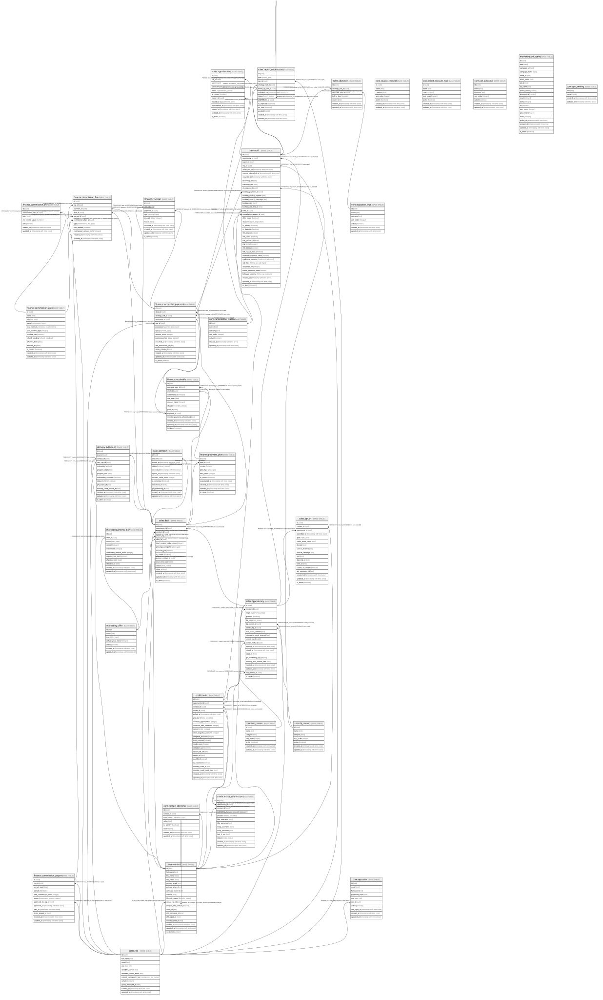

# The Credit Brothers - Sales System (Supabase / Postgres)

## Tables

| Name | Columns | Comment | Type |
| ---- | ------- | ------- | ---- |
| [core.cancellation_reason](core.cancellation_reason.md) | 7 |  | BASE TABLE |
| [core.dq_reason](core.dq_reason.md) | 7 |  | BASE TABLE |
| [core.source_channel](core.source_channel.md) | 7 |  | BASE TABLE |
| [core.credit_account_type](core.credit_account_type.md) | 7 |  | BASE TABLE |
| [core.call_outcome](core.call_outcome.md) | 7 |  | BASE TABLE |
| [core.objection_type](core.objection_type.md) | 7 |  | BASE TABLE |
| [sales.rep](sales.rep.md) | 11 |  | BASE TABLE |
| [core.contact](core.contact.md) | 17 | One real person = the Close "Lead" (1:1). Extra emails/phones live in contact_identifier. | BASE TABLE |
| [core.contact_identifier](core.contact_identifier.md) | 8 | A person's extra emails/phones. Append-only, never overwrite; match across all when deduping. | BASE TABLE |
| [marketing.offer](marketing.offer.md) | 7 |  | BASE TABLE |
| [marketing.pricing_plan](marketing.pricing_plan.md) | 11 |  | BASE TABLE |
| [sales.opportunity](sales.opportunity.md) | 18 | A sales-cycle instance and the main reporting unit. Contact : Opportunity = 1:N — a contact can have multiple opportunities over time (repeat purchases) and more than one may be open at once; the database mirrors Close. The automation works with one active opportunity at a time and never OVERWRITES a won opportunity (it creates a new one for new activity), but that is sync/automation logic, NOT a database rule — an opportunity created by hand in Close syncs straight through. | BASE TABLE |
| [sales.opt_in](sales.opt_in.md) | 16 | A marketing lead-form submission. Carries the source that feeds first-touch. | BASE TABLE |
| [credit.intake_submission](credit.intake_submission.md) | 13 | ⚠️ PII (idiq/msiq logins + SSN-last-4). Ciphertext only, RLS-locked to service role, purge after use. | BASE TABLE |
| [credit.nafa](credit.nafa.md) | 22 | One credit-report pull rendered as a NAFA. 1:N per opportunity (history kept); is_canonical = the latest valid. | BASE TABLE |
| [sales.call](sales.call.md) | 35 | All calls in one table (type = readiness/strategy/follow_up). The strategy call is the booking; funnel KPIs filter type=strategy. | BASE TABLE |
| [sales.appointment](sales.appointment.md) | 11 | One scheduled slot of a strategy booking. Each reschedule = a new row; terminal slots are immutable. Reschedule = status=rescheduled. | BASE TABLE |
| [sales.deal](sales.deal.md) | 15 | A won opportunity + terms. Always one offer per deal. status never deleted. | BASE TABLE |
| [sales.contract](sales.contract.md) | 12 |  | BASE TABLE |
| [finance.payment_plan](finance.payment_plan.md) | 9 | Versioned schedule. A re-split creates a new version + new receivables (the #1 bug fix); old version not-current. | BASE TABLE |
| [finance.receivable](finance.receivable.md) | 12 | One scheduled installment of a payment-plan version. Drives pipeline value, projected cash, delinquency, collection rate. | BASE TABLE |
| [finance.successful_payment](finance.successful_payment.md) | 14 | A cleared transaction. Cash collected = NMI gross, excludes booking_25, net of reversals. | BASE TABLE |
| [finance.reversal](finance.reversal.md) | 9 |  | BASE TABLE |
| [finance.commission_plan](finance.commission_plan.md) | 13 |  | BASE TABLE |
| [finance.commission_tier](finance.commission_tier.md) | 7 |  | BASE TABLE |
| [finance.commission_payout](finance.commission_payout.md) | 12 |  | BASE TABLE |
| [finance.commission_line](finance.commission_line.md) | 11 | Per commissionable payment, auto-calculated, rate frozen. Its own table so one payment can split across reps and clawbacks can exist with no payment. | BASE TABLE |
| [marketing.ad_spend](marketing.ad_spend.md) | 19 | Meta insights, grain = (date x ad_id). Trailing-window upsert by pulled_at for restatements. Lock the ad-account timezone first. | BASE TABLE |
| [delivery.fulfilment](delivery.fulfilment.md) | 13 | Delivery of ONE purchased service (1:1 deal). The client is the contact; contact:deal = 1:N. Created when the opportunity reaches stage won_pif or won_pp (the onboarding trigger). | BASE TABLE |
| [sales.report_submission](sales.report_submission.md) | 13 |  | BASE TABLE |
| [sales.objection](sales.objection.md) | 7 |  | BASE TABLE |

## Enums

| Name | Values |
| ---- | ------- |
| auth.aal_level | aal1, aal2, aal3 |
| auth.code_challenge_method | plain, s256 |
| auth.factor_status | unverified, verified |
| auth.factor_type | phone, totp, webauthn |
| auth.oauth_authorization_status | approved, denied, expired, pending |
| auth.oauth_client_type | confidential, public |
| auth.oauth_registration_type | dynamic, manual |
| auth.oauth_response_type | code |
| auth.one_time_token_type | confirmation_token, email_change_token_current, email_change_token_new, phone_change_token, reauthentication_token, recovery_token |
| public.appointment_actor | closer, lead_link |
| public.appointment_status | cancelled_by_lead, cancelled_by_team, confirmed, no_show, rescheduled, scheduled, taken |
| public.call_disposition | closed, dq_on_call, follow_up, no_decision |
| public.call_type | follow_up, readiness, strategy |
| public.commission_basis | cash_collected |
| public.commission_eval_metric | close_rate |
| public.commission_line_type | adjustment, base, clawback, residual |
| public.commission_payout_status | approved, calculated, paid |
| public.commission_tier_name | base_10, elevated_15 |
| public.contact_identifier_type | email, phone |
| public.contract_status | completed, sent, viewed, void |
| public.deal_status | active, churned, refunded |
| public.dq_stage | closing, setting |
| public.follow_up_outcome | closed, dq, follow_up, no_show, reschedule |
| public.follow_up_sub_type | enrollment, follow_up |
| public.fulfilment_status | active, churned, completed, refunded |
| public.intake_provider | identityiq, myscoreiq |
| public.intake_status | failed, submitted, verified |
| public.lifecycle_status | customer, do_not_contact, lead, qualified |
| public.nafa_version | A, B, C, D |
| public.offer_type | booking_fee, coaching, community, core, funding, lto |
| public.opportunity_stage | audit_complete, call_canceled_by_lead, call_canceled_by_team, call_confirmed, contract_sent, contract_signed, deposit, dq_on_call, follow_up_call_booked, intake_form_needed, intake_form_submitted, lead_opt_in, lost, no_show, strategy_call_booked, warm_list, won_pif, won_pp |
| public.optin_goal | business_credit, car, credit_cards, house, other |
| public.payment_processor | nmi, stripe |
| public.payment_type | booking_25, deposit, installment, pif |
| public.plan_type | 12pay, 13pay, 3pay, 6pay, 7pay, pif, zero_down |
| public.readiness_outcome | confirmed_ready, dq, no_contact, reschedule |
| public.receivable_status | delinquent, late, paid, scheduled, waived |
| public.refund_handling | clawback, none |
| public.rep_role | admin, closer, csm, hybrid, setter |
| public.report_status | rejected, submitted, superseded, validated |
| public.report_type | missed_call, post_call_notes, sales_call |
| public.reversal_type | chargeback, refund |
| realtime.action | DELETE, ERROR, INSERT, TRUNCATE, UPDATE |
| realtime.equality_op | eq, gt, gte, ilike, imatch, in, is, isdistinct, like, lt, lte, match, neq |
| storage.buckettype | ANALYTICS, STANDARD, VECTOR |

## Relations

---

> Generated by [tbls](https://github.com/k1LoW/tbls)
