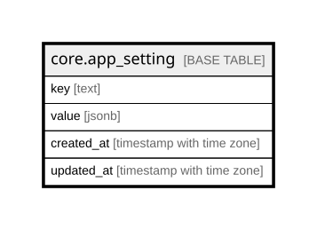

# core.app_setting

## Description

App-level configuration (key/value). e.g. demo_mode, report timezone.

## Columns

| Name | Type | Default | Nullable | Children | Parents | Comment |
| ---- | ---- | ------- | -------- | -------- | ------- | ------- |
| key | text |  | false |  |  | Setting name. |
| value | jsonb |  | false |  |  | Setting value (jsonb). |
| created_at | timestamp with time zone | now() | false |  |  | When this row was created. |
| updated_at | timestamp with time zone | now() | false |  |  | When this row was last updated (auto-maintained). |

## Constraints

| Name | Type | Definition |
| ---- | ---- | ---------- |
| app_setting_pkey | PRIMARY KEY | PRIMARY KEY (key) |

## Indexes

| Name | Definition |
| ---- | ---------- |
| app_setting_pkey | CREATE UNIQUE INDEX app_setting_pkey ON core.app_setting USING btree (key) |

## Triggers

| Name | Definition |
| ---- | ---------- |
| trg_app_setting_updated | CREATE TRIGGER trg_app_setting_updated BEFORE UPDATE ON core.app_setting FOR EACH ROW EXECUTE FUNCTION set_updated_at() |

## Relations

---

> Generated by [tbls](https://github.com/k1LoW/tbls)
