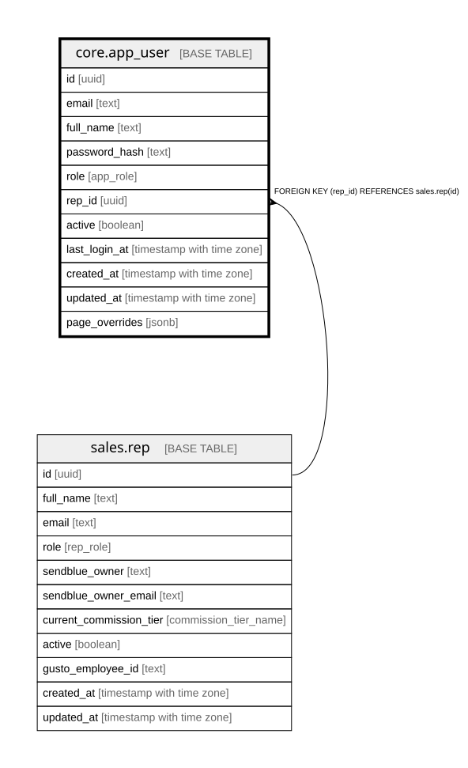

# core.app_user

## Description

Dashboard login accounts (scrypt password hashes). Verified server-side only; no client access. rep_id links a login to their sales.rep record so forms pre-fill.

## Columns

| Name | Type | Default | Nullable | Children | Parents | Comment |
| ---- | ---- | ------- | -------- | -------- | ------- | ------- |
| id | uuid | gen_random_uuid() | false |  |  | Primary key (uuid, auto-generated). |
| email | text |  | false |  |  | Login email (unique). |
| full_name | text |  | false |  |  | Display name. |
| password_hash | text |  | false |  |  | scrypt hash (scrypt$N$r$p$salt$hash). Never a plaintext password. |
| role | app_role | 'closer'::app_role | false |  |  | Dashboard role: admin / leadership / closer / setter / csm — drives what pages and actions are visible. |
| rep_id | uuid |  | true |  | [sales.rep](sales.rep.md) | FK to sales.rep, when this login belongs to a rep. |
| active | boolean | true | false |  |  | Whether the login is enabled. |
| last_login_at | timestamp with time zone |  | true |  |  | Last successful login. |
| created_at | timestamp with time zone | now() | false |  |  | When this row was created. |
| updated_at | timestamp with time zone | now() | false |  |  | When this row was last updated (auto-maintained). |
| page_overrides | jsonb | '{}'::jsonb | false |  |  | Per-user page access overrides on top of the role defaults: {"\<page\>": true\|false}. Absent key = role default. Pages: overview, funnel, calls, receivables, reps, marketing, forms. Admin-only pages (connections, admin) never override. |

## Constraints

| Name | Type | Definition |
| ---- | ---- | ---------- |
| app_user_rep_id_fkey | FOREIGN KEY | FOREIGN KEY (rep_id) REFERENCES sales.rep(id) |
| app_user_pkey | PRIMARY KEY | PRIMARY KEY (id) |
| app_user_email_key | UNIQUE | UNIQUE (email) |

## Indexes

| Name | Definition |
| ---- | ---------- |
| app_user_pkey | CREATE UNIQUE INDEX app_user_pkey ON core.app_user USING btree (id) |
| app_user_email_key | CREATE UNIQUE INDEX app_user_email_key ON core.app_user USING btree (email) |

## Triggers

| Name | Definition |
| ---- | ---------- |
| trg_app_user_updated | CREATE TRIGGER trg_app_user_updated BEFORE UPDATE ON core.app_user FOR EACH ROW EXECUTE FUNCTION set_updated_at() |

## Relations

---

> Generated by [tbls](https://github.com/k1LoW/tbls)
