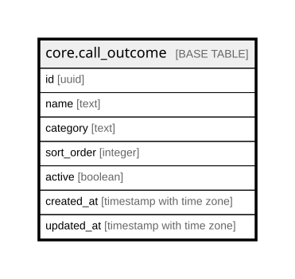

# core.call_outcome

## Columns

| Name | Type | Default | Nullable | Children | Parents | Comment |
| ---- | ---- | ------- | -------- | -------- | ------- | ------- |
| id | uuid | gen_random_uuid() | false |  |  | Primary key (uuid, auto-generated). |
| name | text |  | false |  |  | The option label shown in the UI and reports. |
| category | text |  | true |  |  | Optional grouping for the option. |
| sort_order | integer |  | true |  |  | Display order. |
| active | boolean | true | false |  |  | Whether the option is currently selectable. |
| created_at | timestamp with time zone | now() | false |  |  | When this row was created. |
| updated_at | timestamp with time zone | now() | false |  |  | When this row was last updated (auto-maintained). |

## Constraints

| Name | Type | Definition |
| ---- | ---- | ---------- |
| call_outcome_pkey | PRIMARY KEY | PRIMARY KEY (id) |

## Indexes

| Name | Definition |
| ---- | ---------- |
| call_outcome_pkey | CREATE UNIQUE INDEX call_outcome_pkey ON core.call_outcome USING btree (id) |

## Triggers

| Name | Definition |
| ---- | ---------- |
| trg_call_outcome_updated | CREATE TRIGGER trg_call_outcome_updated BEFORE UPDATE ON core.call_outcome FOR EACH ROW EXECUTE FUNCTION set_updated_at() |

## Relations

---

> Generated by [tbls](https://github.com/k1LoW/tbls)
