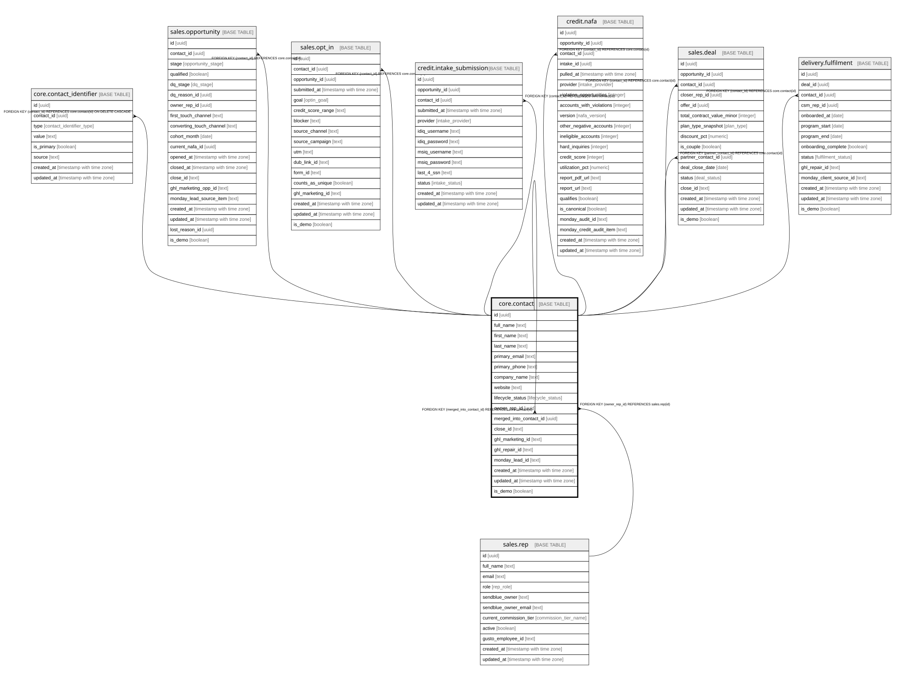

# core.contact

## Description

One real person = the Close "Lead" (1:1). Extra emails/phones live in contact_identifier.

## Columns

| Name | Type | Default | Nullable | Children | Parents | Comment |
| ---- | ---- | ------- | -------- | -------- | ------- | ------- |
| id | uuid | gen_random_uuid() | false | [core.contact](core.contact.md) [core.contact_identifier](core.contact_identifier.md) [sales.opportunity](sales.opportunity.md) [sales.opt_in](sales.opt_in.md) [credit.intake_submission](credit.intake_submission.md) [credit.nafa](credit.nafa.md) [sales.deal](sales.deal.md) [delivery.fulfilment](delivery.fulfilment.md) |  | Primary key (uuid, auto-generated). |
| full_name | text |  | false |  |  | The person's full name. |
| first_name | text |  | true |  |  | First name (for personalization). |
| last_name | text |  | true |  |  | Last name (for personalization). |
| primary_email | text |  | true |  |  | Current primary email; the full set lives in contact_identifier. |
| primary_phone | text |  | true |  |  | Current primary phone; the full set lives in contact_identifier. |
| company_name | text |  | true |  |  | For business-funding leads. |
| website | text |  | true |  |  | For business-funding leads. |
| lifecycle_status | lifecycle_status | 'lead'::lifecycle_status | false |  |  | lead / qualified / customer / do_not_contact. Never downgrade from customer or do_not_contact. |
| owner_rep_id | uuid |  | true |  | [sales.rep](sales.rep.md) | Current owning rep. Per-activity owners live on each Call. |
| merged_into_contact_id | uuid |  | true |  | [core.contact](core.contact.md) | Set when this person is merged into another during dedup; keeps both histories. |
| close_id | text |  | true |  |  | Cross-system sync key (Close Lead id). |
| ghl_marketing_id | text |  | true |  |  | Cross-system key: the contact id in GHL Marketing. |
| ghl_repair_id | text |  | true |  |  | Cross-system key: the contact id in GHL Repair / Fulfilment. |
| monday_lead_id | text |  | true |  |  | Cross-system key: the lead id in Monday. |
| created_at | timestamp with time zone | now() | false |  |  | When this row was created. |
| updated_at | timestamp with time zone | now() | false |  |  | When this row was last updated (auto-maintained). |
| is_demo | boolean | false | false |  |  | Demo-mode row (obviously fake data for verifying features). Purge = delete where is_demo. |

## Constraints

| Name | Type | Definition |
| ---- | ---- | ---------- |
| contact_owner_rep_id_fkey | FOREIGN KEY | FOREIGN KEY (owner_rep_id) REFERENCES sales.rep(id) |
| contact_merged_into_contact_id_fkey | FOREIGN KEY | FOREIGN KEY (merged_into_contact_id) REFERENCES core.contact(id) |
| contact_pkey | PRIMARY KEY | PRIMARY KEY (id) |

## Indexes

| Name | Definition |
| ---- | ---------- |
| contact_pkey | CREATE UNIQUE INDEX contact_pkey ON core.contact USING btree (id) |
| uq_contact_close_id | CREATE UNIQUE INDEX uq_contact_close_id ON core.contact USING btree (close_id) WHERE (close_id IS NOT NULL) |

## Triggers

| Name | Definition |
| ---- | ---------- |
| trg_contact_updated | CREATE TRIGGER trg_contact_updated BEFORE UPDATE ON core.contact FOR EACH ROW EXECUTE FUNCTION set_updated_at() |

## Relations

---

> Generated by [tbls](https://github.com/k1LoW/tbls)
