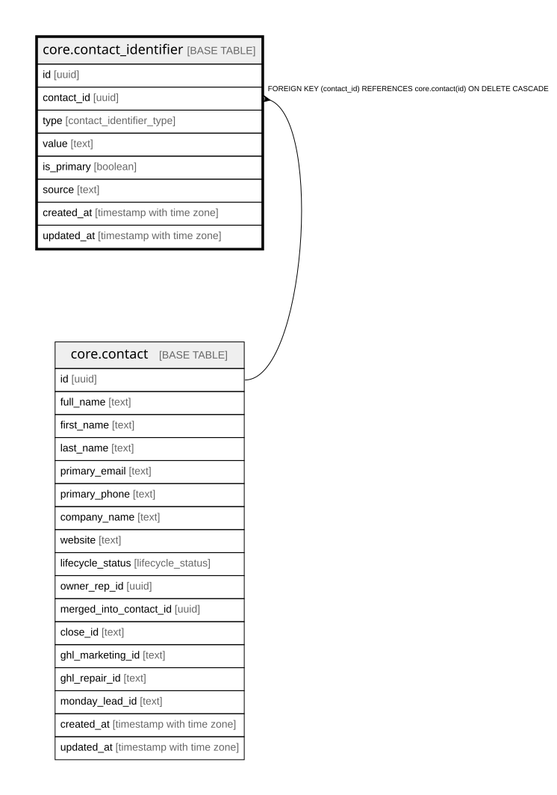

# core.contact_identifier

## Description

A person's extra emails/phones. Append-only, never overwrite; match across all when deduping.

## Columns

| Name | Type | Default | Nullable | Children | Parents | Comment |
| ---- | ---- | ------- | -------- | -------- | ------- | ------- |
| id | uuid | gen_random_uuid() | false |  |  | Primary key (uuid, auto-generated). |
| contact_id | uuid |  | false |  | [core.contact](core.contact.md) | FK to the owning contact. |
| type | contact_identifier_type |  | false |  |  | email or phone. |
| value | text |  | false |  |  | The email or phone. Append a new one if different, never overwrite. |
| is_primary | boolean | false | false |  |  | One primary per type. |
| source | text |  | true |  |  | Where this email/phone came from. |
| created_at | timestamp with time zone | now() | false |  |  | When this row was created. |
| updated_at | timestamp with time zone | now() | false |  |  | When this row was last updated (auto-maintained). |

## Constraints

| Name | Type | Definition |
| ---- | ---- | ---------- |
| contact_identifier_contact_id_fkey | FOREIGN KEY | FOREIGN KEY (contact_id) REFERENCES core.contact(id) ON DELETE CASCADE |
| contact_identifier_pkey | PRIMARY KEY | PRIMARY KEY (id) |

## Indexes

| Name | Definition |
| ---- | ---------- |
| contact_identifier_pkey | CREATE UNIQUE INDEX contact_identifier_pkey ON core.contact_identifier USING btree (id) |
| uq_identifier_value | CREATE UNIQUE INDEX uq_identifier_value ON core.contact_identifier USING btree (type, lower(value)) |
| uq_identifier_primary | CREATE UNIQUE INDEX uq_identifier_primary ON core.contact_identifier USING btree (contact_id, type) WHERE is_primary |

## Triggers

| Name | Definition |
| ---- | ---------- |
| trg_contact_identifier_updated | CREATE TRIGGER trg_contact_identifier_updated BEFORE UPDATE ON core.contact_identifier FOR EACH ROW EXECUTE FUNCTION set_updated_at() |

## Relations

---

> Generated by [tbls](https://github.com/k1LoW/tbls)
