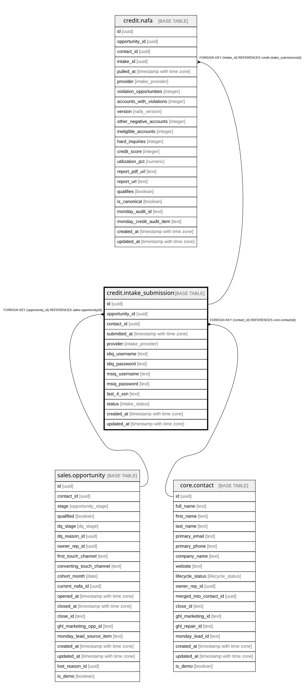

# credit.intake_submission

## Description

⚠️ PII (idiq/msiq logins + SSN-last-4). Ciphertext only, RLS-locked to service role, purge after use.

## Columns

| Name | Type | Default | Nullable | Children | Parents | Comment |
| ---- | ---- | ------- | -------- | -------- | ------- | ------- |
| id | uuid | gen_random_uuid() | false | [credit.nafa](credit.nafa.md) |  | Primary key (uuid, auto-generated). |
| opportunity_id | uuid |  | false |  | [sales.opportunity](sales.opportunity.md) | FK to the opportunity. |
| contact_id | uuid |  | false |  | [core.contact](core.contact.md) | FK to the contact. |
| submitted_at | timestamp with time zone |  | false |  |  | When the intake form was submitted. |
| provider | intake_provider |  | false |  |  | identityiq or myscoreiq. |
| idiq_username | text |  | true |  |  | ENCRYPTED PII — ciphertext only. Purge after use. |
| idiq_password | text |  | true |  |  | ENCRYPTED PII — ciphertext only. Purge after use. |
| msiq_username | text |  | true |  |  | ENCRYPTED PII — ciphertext only. Purge after use. |
| msiq_password | text |  | true |  |  | ENCRYPTED PII — ciphertext only. Purge after use. |
| last_4_ssn | text |  | true |  |  | ENCRYPTED PII (last 4 of SSN) — ciphertext only. Purge after use. |
| status | intake_status | 'submitted'::intake_status | false |  |  | submitted / verified / failed (login tested by the worker). |
| created_at | timestamp with time zone | now() | false |  |  | When this row was created. |
| updated_at | timestamp with time zone | now() | false |  |  | When this row was last updated (auto-maintained). |

## Constraints

| Name | Type | Definition |
| ---- | ---- | ---------- |
| intake_submission_contact_id_fkey | FOREIGN KEY | FOREIGN KEY (contact_id) REFERENCES core.contact(id) |
| intake_submission_opportunity_id_fkey | FOREIGN KEY | FOREIGN KEY (opportunity_id) REFERENCES sales.opportunity(id) |
| intake_submission_pkey | PRIMARY KEY | PRIMARY KEY (id) |

## Indexes

| Name | Definition |
| ---- | ---------- |
| intake_submission_pkey | CREATE UNIQUE INDEX intake_submission_pkey ON credit.intake_submission USING btree (id) |
| ix_intake_opp | CREATE INDEX ix_intake_opp ON credit.intake_submission USING btree (opportunity_id) |

## Triggers

| Name | Definition |
| ---- | ---------- |
| trg_intake_submission_updated | CREATE TRIGGER trg_intake_submission_updated BEFORE UPDATE ON credit.intake_submission FOR EACH ROW EXECUTE FUNCTION set_updated_at() |

## Relations

---

> Generated by [tbls](https://github.com/k1LoW/tbls)
