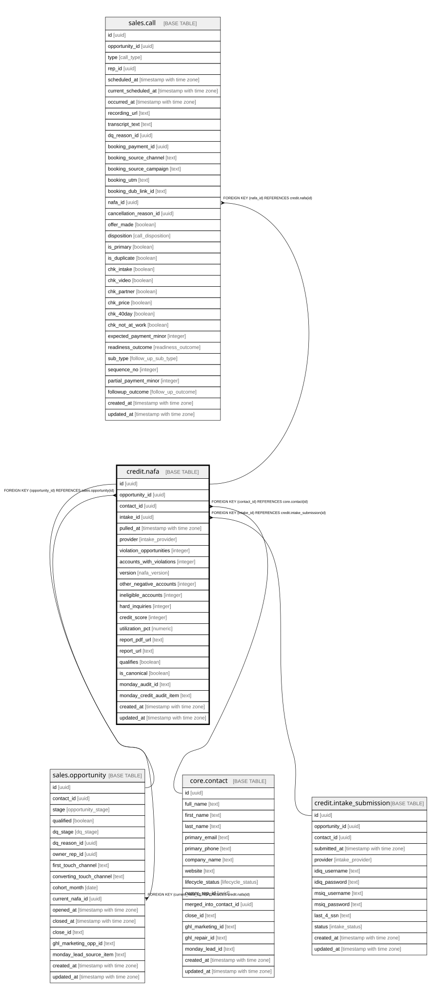

# credit.nafa

## Description

One credit-report pull rendered as a NAFA. 1:N per opportunity (history kept); is_canonical = the latest valid.

## Columns

| Name | Type | Default | Nullable | Children | Parents | Comment |
| ---- | ---- | ------- | -------- | -------- | ------- | ------- |
| id | uuid | gen_random_uuid() | false | [sales.opportunity](sales.opportunity.md) [sales.call](sales.call.md) |  | Primary key (uuid, auto-generated). |
| opportunity_id | uuid |  | false |  | [sales.opportunity](sales.opportunity.md) | FK to the opportunity. |
| contact_id | uuid |  | false |  | [core.contact](core.contact.md) | FK to the contact. |
| intake_id | uuid |  | true |  | [credit.intake_submission](credit.intake_submission.md) | FK to the intake submission whose credentials were used. |
| pulled_at | timestamp with time zone |  | false |  |  | The snapshot date of this credit pull. |
| provider | intake_provider |  | true |  |  | The credit-monitoring provider used (identityiq or myscoreiq). |
| violation_opportunities | integer |  | true |  |  | Headline count of violation opportunities. |
| accounts_with_violations | integer |  | true |  |  | Accounts with violations — pricing is based on these. |
| version | nafa_version |  | true |  |  | A / B / C / D — lead-profile / script class. |
| other_negative_accounts | integer |  | true |  |  | Count of other negative accounts (included at no extra cost). |
| ineligible_accounts | integer |  | true |  |  | Count of ineligible accounts (student loan, bankruptcy, government, child support). |
| hard_inquiries | integer |  | true |  |  | Count of eligible hard inquiries. |
| credit_score | integer |  | true |  |  | The credit score on this pull. |
| utilization_pct | numeric |  | true |  |  | Credit utilization percentage. |
| report_pdf_url | text |  | true |  |  | The NAFA PDF (stored on Close Files). |
| report_url | text |  | true |  |  | The NAFA report URL closers send. |
| qualifies | boolean |  | true |  |  | Derived: \>=5 violation ops AND \>=2 accounts with violations. |
| is_canonical | boolean | true | false |  |  | Latest valid NAFA = the one used for auto-DQ, scoring, and the pitch. |
| monday_audit_id | text |  | true |  |  | Cross-system key: the Monday audit id. |
| monday_credit_audit_item | text |  | true |  |  | Cross-system key: the Monday credit-audit item. |
| created_at | timestamp with time zone | now() | false |  |  | When this row was created. |
| updated_at | timestamp with time zone | now() | false |  |  | When this row was last updated (auto-maintained). |

## Constraints

| Name | Type | Definition |
| ---- | ---- | ---------- |
| nafa_contact_id_fkey | FOREIGN KEY | FOREIGN KEY (contact_id) REFERENCES core.contact(id) |
| nafa_opportunity_id_fkey | FOREIGN KEY | FOREIGN KEY (opportunity_id) REFERENCES sales.opportunity(id) |
| nafa_intake_id_fkey | FOREIGN KEY | FOREIGN KEY (intake_id) REFERENCES credit.intake_submission(id) |
| nafa_pkey | PRIMARY KEY | PRIMARY KEY (id) |

## Indexes

| Name | Definition |
| ---- | ---------- |
| nafa_pkey | CREATE UNIQUE INDEX nafa_pkey ON credit.nafa USING btree (id) |
| uq_canonical_nafa | CREATE UNIQUE INDEX uq_canonical_nafa ON credit.nafa USING btree (opportunity_id) WHERE is_canonical |
| ix_nafa_opp | CREATE INDEX ix_nafa_opp ON credit.nafa USING btree (opportunity_id) |

## Triggers

| Name | Definition |
| ---- | ---------- |
| trg_nafa_updated | CREATE TRIGGER trg_nafa_updated BEFORE UPDATE ON credit.nafa FOR EACH ROW EXECUTE FUNCTION set_updated_at() |

## Relations

---

> Generated by [tbls](https://github.com/k1LoW/tbls)
