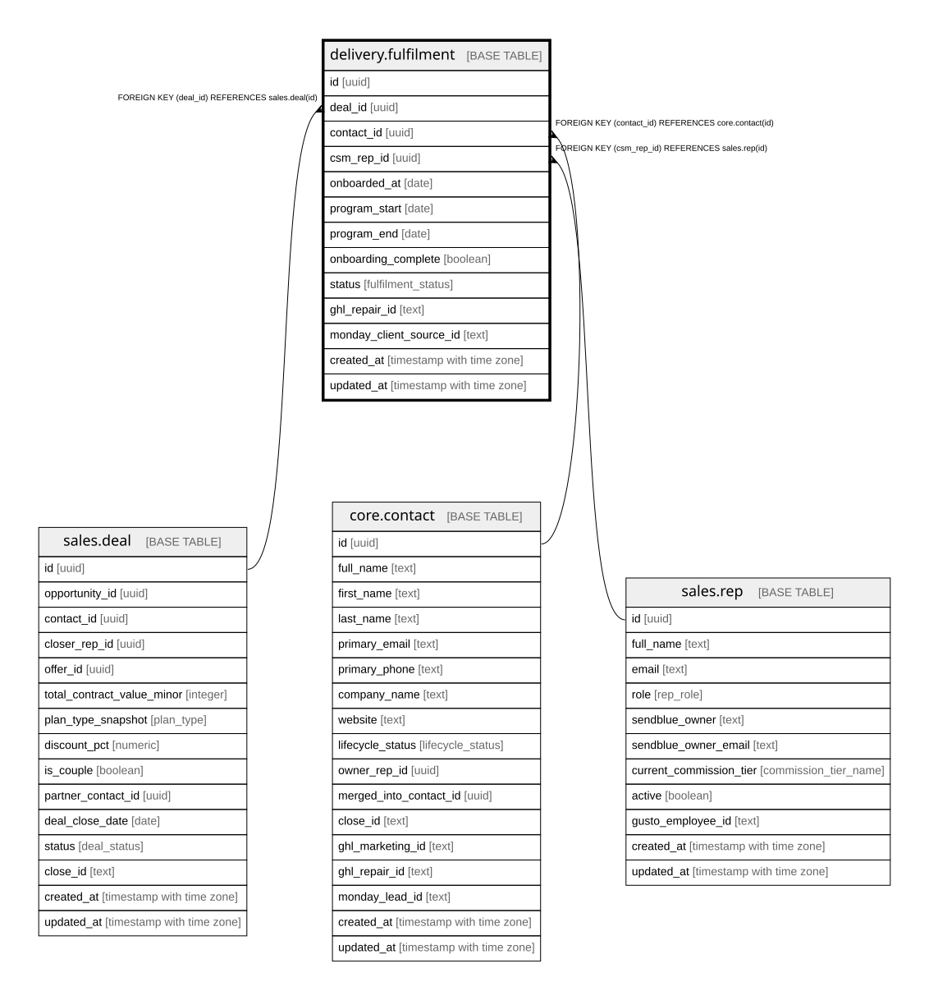

# delivery.fulfilment

## Description

Delivery of ONE purchased service (1:1 deal). The client is the contact; contact:deal = 1:N. Created when the opportunity reaches stage won_pif or won_pp (the onboarding trigger).

## Columns

| Name | Type | Default | Nullable | Children | Parents | Comment |
| ---- | ---- | ------- | -------- | -------- | ------- | ------- |
| id | uuid | gen_random_uuid() | false |  |  | Primary key (uuid, auto-generated). |
| deal_id | uuid |  | false |  | [sales.deal](sales.deal.md) | FK to the deal being delivered. |
| contact_id | uuid |  | false |  | [core.contact](core.contact.md) | FK to the client (the contact). |
| csm_rep_id | uuid |  | true |  | [sales.rep](sales.rep.md) | The client-success manager. |
| onboarded_at | date |  | true |  |  | When the client was onboarded. |
| program_start | date |  | true |  |  | 6-month program start. |
| program_end | date |  | true |  |  | 12-month team-access end. |
| onboarding_complete | boolean |  | true |  |  | Drives the onboarding-completion KPI. |
| status | fulfilment_status | 'active'::fulfilment_status | false |  |  | active / completed / churned / refunded. |
| ghl_repair_id | text |  | true |  |  | Cross-system key: the client id in GHL Repair. |
| monday_client_source_id | text |  | true |  |  | Cross-system key: the Monday client-source id. |
| created_at | timestamp with time zone | now() | false |  |  | When this row was created. |
| updated_at | timestamp with time zone | now() | false |  |  | When this row was last updated (auto-maintained). |

## Constraints

| Name | Type | Definition |
| ---- | ---- | ---------- |
| fulfilment_csm_rep_id_fkey | FOREIGN KEY | FOREIGN KEY (csm_rep_id) REFERENCES sales.rep(id) |
| fulfilment_contact_id_fkey | FOREIGN KEY | FOREIGN KEY (contact_id) REFERENCES core.contact(id) |
| fulfilment_deal_id_fkey | FOREIGN KEY | FOREIGN KEY (deal_id) REFERENCES sales.deal(id) |
| fulfilment_pkey | PRIMARY KEY | PRIMARY KEY (id) |

## Indexes

| Name | Definition |
| ---- | ---------- |
| fulfilment_pkey | CREATE UNIQUE INDEX fulfilment_pkey ON delivery.fulfilment USING btree (id) |
| ix_fulfilment_deal | CREATE INDEX ix_fulfilment_deal ON delivery.fulfilment USING btree (deal_id) |

## Triggers

| Name | Definition |
| ---- | ---------- |
| trg_fulfilment_updated | CREATE TRIGGER trg_fulfilment_updated BEFORE UPDATE ON delivery.fulfilment FOR EACH ROW EXECUTE FUNCTION set_updated_at() |

## Relations

---

> Generated by [tbls](https://github.com/k1LoW/tbls)
