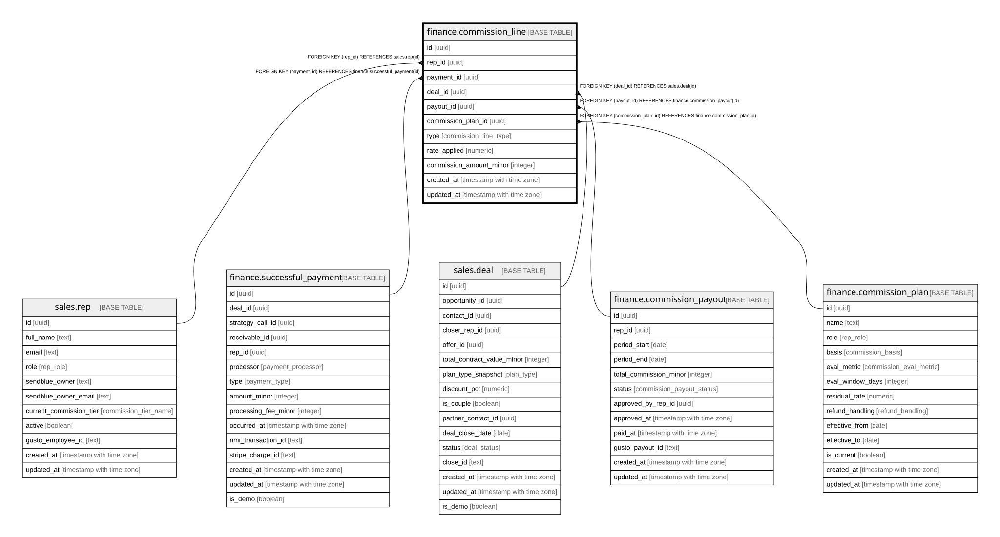

# finance.commission_line

## Description

Per commissionable payment, auto-calculated, rate frozen. Its own table so one payment can split across reps and clawbacks can exist with no payment.

## Columns

| Name | Type | Default | Nullable | Children | Parents | Comment |
| ---- | ---- | ------- | -------- | -------- | ------- | ------- |
| id | uuid | gen_random_uuid() | false |  |  | Primary key (uuid, auto-generated). |
| rep_id | uuid |  | false |  | [sales.rep](sales.rep.md) | FK to the rep earning the commission. |
| payment_id | uuid |  | true |  | [finance.successful_payment](finance.successful_payment.md) | The cash this commission is on (null for clawback / adjustment lines). |
| deal_id | uuid |  | true |  | [sales.deal](sales.deal.md) | FK to the deal (if applicable). |
| payout_id | uuid |  | true |  | [finance.commission_payout](finance.commission_payout.md) | FK to the period payout this line rolls into. |
| commission_plan_id | uuid |  | true |  | [finance.commission_plan](finance.commission_plan.md) | FK to the commission plan applied. |
| type | commission_line_type |  | false |  |  | base / residual / adjustment / clawback. |
| rate_applied | numeric |  | false |  |  | The rate, frozen at calculation time. |
| commission_amount_minor | integer |  | false |  |  | payment x rate, in minor units (negative for a clawback). |
| created_at | timestamp with time zone | now() | false |  |  | When this row was created. |
| updated_at | timestamp with time zone | now() | false |  |  | When this row was last updated (auto-maintained). |

## Constraints

| Name | Type | Definition |
| ---- | ---- | ---------- |
| commission_line_rep_id_fkey | FOREIGN KEY | FOREIGN KEY (rep_id) REFERENCES sales.rep(id) |
| commission_line_deal_id_fkey | FOREIGN KEY | FOREIGN KEY (deal_id) REFERENCES sales.deal(id) |
| commission_line_payment_id_fkey | FOREIGN KEY | FOREIGN KEY (payment_id) REFERENCES finance.successful_payment(id) |
| commission_line_commission_plan_id_fkey | FOREIGN KEY | FOREIGN KEY (commission_plan_id) REFERENCES finance.commission_plan(id) |
| commission_line_payout_id_fkey | FOREIGN KEY | FOREIGN KEY (payout_id) REFERENCES finance.commission_payout(id) |
| commission_line_pkey | PRIMARY KEY | PRIMARY KEY (id) |

## Indexes

| Name | Definition |
| ---- | ---------- |
| commission_line_pkey | CREATE UNIQUE INDEX commission_line_pkey ON finance.commission_line USING btree (id) |
| ix_commline_rep | CREATE INDEX ix_commline_rep ON finance.commission_line USING btree (rep_id) |
| ix_commline_payout | CREATE INDEX ix_commline_payout ON finance.commission_line USING btree (payout_id) |

## Triggers

| Name | Definition |
| ---- | ---------- |
| trg_commission_line_updated | CREATE TRIGGER trg_commission_line_updated BEFORE UPDATE ON finance.commission_line FOR EACH ROW EXECUTE FUNCTION set_updated_at() |

## Relations

---

> Generated by [tbls](https://github.com/k1LoW/tbls)
