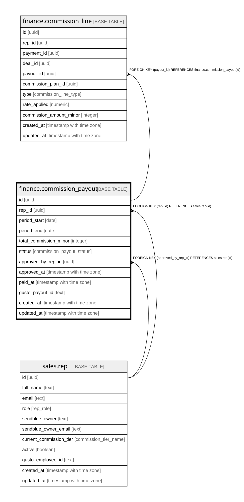

# finance.commission_payout

## Columns

| Name | Type | Default | Nullable | Children | Parents | Comment |
| ---- | ---- | ------- | -------- | -------- | ------- | ------- |
| id | uuid | gen_random_uuid() | false | [finance.commission_line](finance.commission_line.md) |  | Primary key (uuid, auto-generated). |
| rep_id | uuid |  | false |  | [sales.rep](sales.rep.md) | FK to the rep being paid. |
| period_start | date |  | false |  |  | Pay-period start. |
| period_end | date |  | false |  |  | Pay-period end. |
| total_commission_minor | integer | 0 | false |  |  | Sum of the payout's commission lines. |
| status | commission_payout_status | 'calculated'::commission_payout_status | false |  |  | calculated / approved / paid. |
| approved_by_rep_id | uuid |  | true |  | [sales.rep](sales.rep.md) | FK to the admin/VA who approved. |
| approved_at | timestamp with time zone |  | true |  |  | When it was approved. |
| paid_at | timestamp with time zone |  | true |  |  | When it was paid out. |
| gusto_payout_id | text |  | true |  |  | The Gusto payout reference. |
| created_at | timestamp with time zone | now() | false |  |  | When this row was created. |
| updated_at | timestamp with time zone | now() | false |  |  | When this row was last updated (auto-maintained). |

## Constraints

| Name | Type | Definition |
| ---- | ---- | ---------- |
| commission_payout_approved_by_rep_id_fkey | FOREIGN KEY | FOREIGN KEY (approved_by_rep_id) REFERENCES sales.rep(id) |
| commission_payout_rep_id_fkey | FOREIGN KEY | FOREIGN KEY (rep_id) REFERENCES sales.rep(id) |
| commission_payout_pkey | PRIMARY KEY | PRIMARY KEY (id) |

## Indexes

| Name | Definition |
| ---- | ---------- |
| commission_payout_pkey | CREATE UNIQUE INDEX commission_payout_pkey ON finance.commission_payout USING btree (id) |
| uq_payout_period | CREATE UNIQUE INDEX uq_payout_period ON finance.commission_payout USING btree (rep_id, period_start, period_end) |

## Triggers

| Name | Definition |
| ---- | ---------- |
| trg_commission_payout_updated | CREATE TRIGGER trg_commission_payout_updated BEFORE UPDATE ON finance.commission_payout FOR EACH ROW EXECUTE FUNCTION set_updated_at() |

## Relations

---

> Generated by [tbls](https://github.com/k1LoW/tbls)
