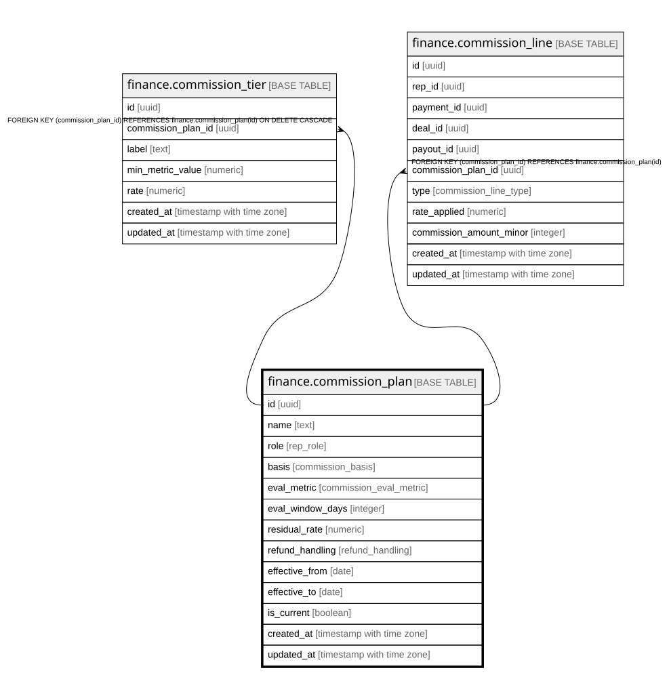

# finance.commission_plan

## Columns

| Name | Type | Default | Nullable | Children | Parents | Comment |
| ---- | ---- | ------- | -------- | -------- | ------- | ------- |
| id | uuid | gen_random_uuid() | false | [finance.commission_tier](finance.commission_tier.md) [finance.commission_line](finance.commission_line.md) |  | Primary key (uuid, auto-generated). |
| name | text |  | false |  |  | Plan name (e.g. "Closer comp v2"). |
| role | rep_role |  | false |  |  | Who it applies to: setter or closer. |
| basis | commission_basis | 'cash_collected'::commission_basis | false |  |  | cash_collected — calculated on gross cash, excluding the $25. |
| eval_metric | commission_eval_metric |  | true |  |  | The metric that sets the tier (close_rate). |
| eval_window_days | integer |  | true |  |  | The lookback window in days (e.g. 14 = prior 2 weeks). |
| residual_rate | numeric |  | true |  |  | Rate on plan-installment residuals. |
| refund_handling | refund_handling |  | true |  |  | clawback or none. |
| effective_from | date |  | false |  |  | When this plan version takes effect. |
| effective_to | date |  | true |  |  | When this plan version ends (null = current). |
| is_current | boolean | true | false |  |  | One current plan per role (versioned config). |
| created_at | timestamp with time zone | now() | false |  |  | When this row was created. |
| updated_at | timestamp with time zone | now() | false |  |  | When this row was last updated (auto-maintained). |

## Constraints

| Name | Type | Definition |
| ---- | ---- | ---------- |
| commission_plan_pkey | PRIMARY KEY | PRIMARY KEY (id) |

## Indexes

| Name | Definition |
| ---- | ---------- |
| commission_plan_pkey | CREATE UNIQUE INDEX commission_plan_pkey ON finance.commission_plan USING btree (id) |
| uq_current_comm_plan | CREATE UNIQUE INDEX uq_current_comm_plan ON finance.commission_plan USING btree (role) WHERE is_current |

## Triggers

| Name | Definition |
| ---- | ---------- |
| trg_commission_plan_updated | CREATE TRIGGER trg_commission_plan_updated BEFORE UPDATE ON finance.commission_plan FOR EACH ROW EXECUTE FUNCTION set_updated_at() |

## Relations

---

> Generated by [tbls](https://github.com/k1LoW/tbls)
