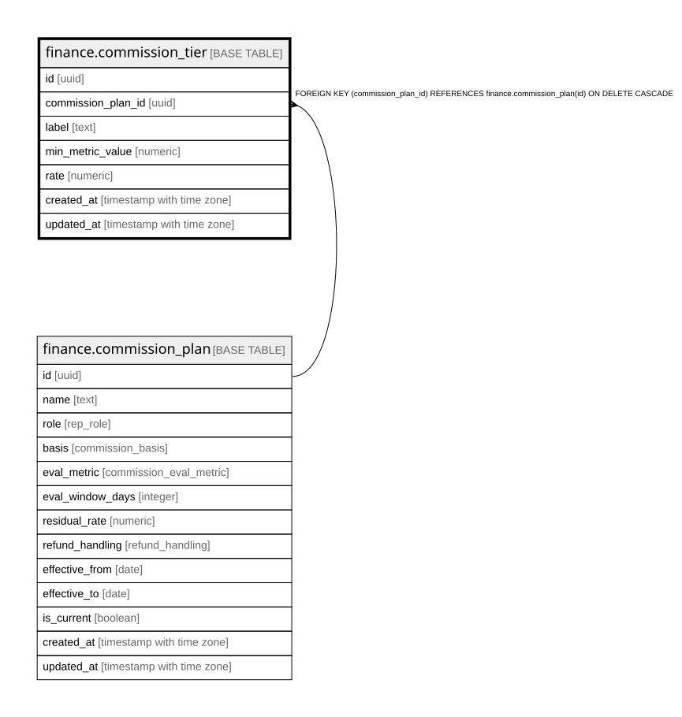

# finance.commission_tier

## Columns

| Name | Type | Default | Nullable | Children | Parents | Comment |
| ---- | ---- | ------- | -------- | -------- | ------- | ------- |
| id | uuid | gen_random_uuid() | false |  |  | Primary key (uuid, auto-generated). |
| commission_plan_id | uuid |  | false |  | [finance.commission_plan](finance.commission_plan.md) | FK to the commission plan. |
| label | text |  | true |  |  | Tier label (e.g. "Base" / "Elevated"). |
| min_metric_value | numeric |  | false |  |  | Threshold to reach this tier (e.g. 0.0 or 0.333 close rate). |
| rate | numeric |  | false |  |  | Commission rate at this tier (e.g. 0.10 or 0.15). |
| created_at | timestamp with time zone | now() | false |  |  | When this row was created. |
| updated_at | timestamp with time zone | now() | false |  |  | When this row was last updated (auto-maintained). |

## Constraints

| Name | Type | Definition |
| ---- | ---- | ---------- |
| commission_tier_commission_plan_id_fkey | FOREIGN KEY | FOREIGN KEY (commission_plan_id) REFERENCES finance.commission_plan(id) ON DELETE CASCADE |
| commission_tier_pkey | PRIMARY KEY | PRIMARY KEY (id) |

## Indexes

| Name | Definition |
| ---- | ---------- |
| commission_tier_pkey | CREATE UNIQUE INDEX commission_tier_pkey ON finance.commission_tier USING btree (id) |

## Triggers

| Name | Definition |
| ---- | ---------- |
| trg_commission_tier_updated | CREATE TRIGGER trg_commission_tier_updated BEFORE UPDATE ON finance.commission_tier FOR EACH ROW EXECUTE FUNCTION set_updated_at() |

## Relations

---

> Generated by [tbls](https://github.com/k1LoW/tbls)
