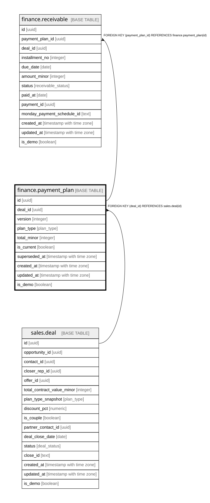

# finance.payment_plan

## Description

Versioned schedule. A re-split creates a new version + new receivables (the #1 bug fix); old version not-current.

## Columns

| Name | Type | Default | Nullable | Children | Parents | Comment |
| ---- | ---- | ------- | -------- | -------- | ------- | ------- |
| id | uuid | gen_random_uuid() | false | [finance.receivable](finance.receivable.md) |  | Primary key (uuid, auto-generated). |
| deal_id | uuid |  | false |  | [sales.deal](sales.deal.md) | FK to the deal. |
| version | integer |  | false |  |  | Bumped on every re-split. |
| plan_type | plan_type |  | true |  |  | The plan structure (pif / 3pay / ... / zero_down). |
| total_minor | integer |  | true |  |  | Total plan amount (minor units). |
| is_current | boolean | true | false |  |  | Only one current version per deal. |
| superseded_at | timestamp with time zone |  | true |  |  | When this version was replaced. |
| created_at | timestamp with time zone | now() | false |  |  | When this row was created. |
| updated_at | timestamp with time zone | now() | false |  |  | When this row was last updated (auto-maintained). |

## Constraints

| Name | Type | Definition |
| ---- | ---- | ---------- |
| payment_plan_deal_id_fkey | FOREIGN KEY | FOREIGN KEY (deal_id) REFERENCES sales.deal(id) |
| payment_plan_pkey | PRIMARY KEY | PRIMARY KEY (id) |

## Indexes

| Name | Definition |
| ---- | ---------- |
| payment_plan_pkey | CREATE UNIQUE INDEX payment_plan_pkey ON finance.payment_plan USING btree (id) |
| uq_current_plan | CREATE UNIQUE INDEX uq_current_plan ON finance.payment_plan USING btree (deal_id) WHERE is_current |
| uq_plan_version | CREATE UNIQUE INDEX uq_plan_version ON finance.payment_plan USING btree (deal_id, version) |
| ix_plan_deal | CREATE INDEX ix_plan_deal ON finance.payment_plan USING btree (deal_id) |

## Triggers

| Name | Definition |
| ---- | ---------- |
| trg_payment_plan_updated | CREATE TRIGGER trg_payment_plan_updated BEFORE UPDATE ON finance.payment_plan FOR EACH ROW EXECUTE FUNCTION set_updated_at() |

## Relations

---

> Generated by [tbls](https://github.com/k1LoW/tbls)
