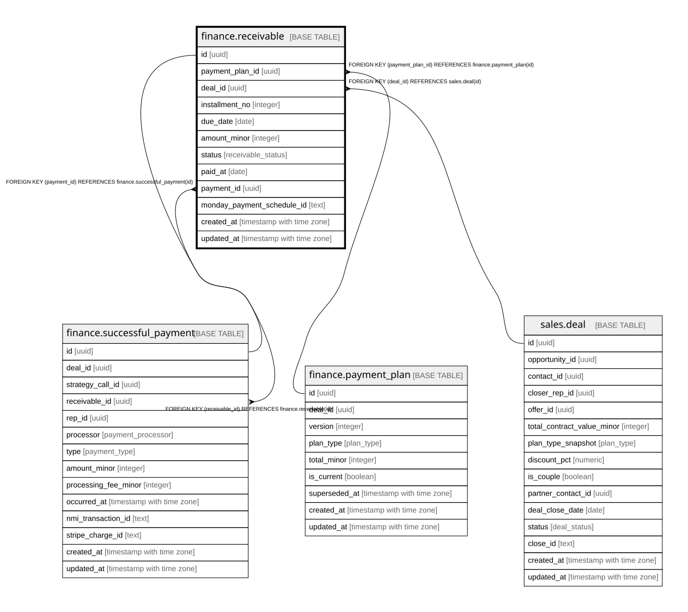

# finance.receivable

## Description

One scheduled installment of a payment-plan version. Drives pipeline value, projected cash, delinquency, collection rate.

## Columns

| Name | Type | Default | Nullable | Children | Parents | Comment |
| ---- | ---- | ------- | -------- | -------- | ------- | ------- |
| id | uuid | gen_random_uuid() | false | [finance.successful_payment](finance.successful_payment.md) |  | Primary key (uuid, auto-generated). |
| payment_plan_id | uuid |  | false |  | [finance.payment_plan](finance.payment_plan.md) | FK to the payment-plan version. |
| deal_id | uuid |  | false |  | [sales.deal](sales.deal.md) | FK to the deal (denormalized for convenience). |
| installment_no | integer |  | false |  |  | Installment number within the plan version. |
| due_date | date |  | false |  |  | When this installment is due. |
| amount_minor | integer |  | false |  |  | Scheduled amount, in minor units. |
| status | receivable_status | 'scheduled'::receivable_status | false |  |  | scheduled / paid / late / delinquent / waived. Delinquent = 14+ days late. |
| paid_at | date |  | true |  |  | When this installment was paid. |
| payment_id | uuid |  | true |  | [finance.successful_payment](finance.successful_payment.md) | The successful_payment that fulfilled this installment. |
| monday_payment_schedule_id | text |  | true |  |  | Cross-system key: the Monday payment-schedule id. |
| created_at | timestamp with time zone | now() | false |  |  | When this row was created. |
| updated_at | timestamp with time zone | now() | false |  |  | When this row was last updated (auto-maintained). |
| is_demo | boolean | false | false |  |  | Demo-mode row (obviously fake data for verifying features). Purge = delete where is_demo. |

## Constraints

| Name | Type | Definition |
| ---- | ---- | ---------- |
| receivable_deal_id_fkey | FOREIGN KEY | FOREIGN KEY (deal_id) REFERENCES sales.deal(id) |
| receivable_payment_plan_id_fkey | FOREIGN KEY | FOREIGN KEY (payment_plan_id) REFERENCES finance.payment_plan(id) |
| receivable_pkey | PRIMARY KEY | PRIMARY KEY (id) |
| receivable_payment_fk | FOREIGN KEY | FOREIGN KEY (payment_id) REFERENCES finance.successful_payment(id) |

## Indexes

| Name | Definition |
| ---- | ---------- |
| receivable_pkey | CREATE UNIQUE INDEX receivable_pkey ON finance.receivable USING btree (id) |
| uq_receivable_installment | CREATE UNIQUE INDEX uq_receivable_installment ON finance.receivable USING btree (payment_plan_id, installment_no) |
| ix_receivable_plan | CREATE INDEX ix_receivable_plan ON finance.receivable USING btree (payment_plan_id) |
| ix_receivable_deal | CREATE INDEX ix_receivable_deal ON finance.receivable USING btree (deal_id) |
| ix_receivable_due | CREATE INDEX ix_receivable_due ON finance.receivable USING btree (due_date) |
| idx_receivable_due | CREATE INDEX idx_receivable_due ON finance.receivable USING btree (due_date) |
| idx_receivable_status | CREATE INDEX idx_receivable_status ON finance.receivable USING btree (status) |

## Triggers

| Name | Definition |
| ---- | ---------- |
| trg_receivable_updated | CREATE TRIGGER trg_receivable_updated BEFORE UPDATE ON finance.receivable FOR EACH ROW EXECUTE FUNCTION set_updated_at() |

## Relations

---

> Generated by [tbls](https://github.com/k1LoW/tbls)
