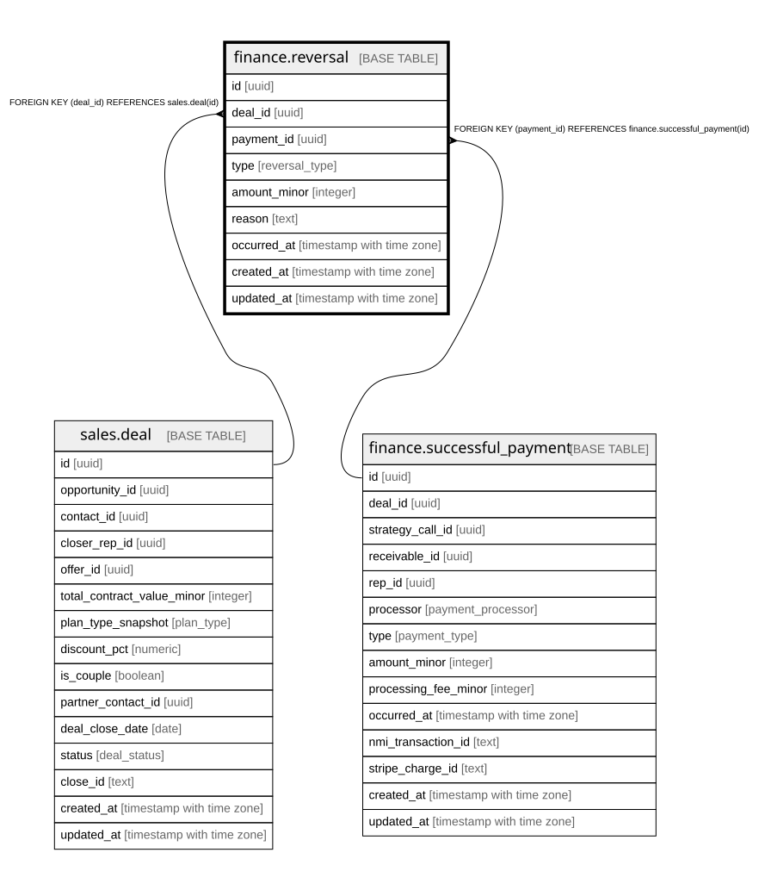

# finance.reversal

## Columns

| Name | Type | Default | Nullable | Children | Parents | Comment |
| ---- | ---- | ------- | -------- | -------- | ------- | ------- |
| id | uuid | gen_random_uuid() | false |  |  | Primary key (uuid, auto-generated). |
| deal_id | uuid |  | false |  | [sales.deal](sales.deal.md) | FK to the deal. |
| payment_id | uuid |  | true |  | [finance.successful_payment](finance.successful_payment.md) | The reversed payment. |
| type | reversal_type |  | false |  |  | refund or chargeback. |
| amount_minor | integer |  | false |  |  | Reversed amount (minor units). |
| reason | text |  | true |  |  | Reason for the refund / chargeback. |
| occurred_at | timestamp with time zone |  | false |  |  | When the reversal occurred. |
| created_at | timestamp with time zone | now() | false |  |  | When this row was created. |
| updated_at | timestamp with time zone | now() | false |  |  | When this row was last updated (auto-maintained). |
| is_demo | boolean | false | false |  |  | Demo-mode row (obviously fake data for verifying features). Purge = delete where is_demo. |

## Constraints

| Name | Type | Definition |
| ---- | ---- | ---------- |
| reversal_deal_id_fkey | FOREIGN KEY | FOREIGN KEY (deal_id) REFERENCES sales.deal(id) |
| reversal_payment_id_fkey | FOREIGN KEY | FOREIGN KEY (payment_id) REFERENCES finance.successful_payment(id) |
| reversal_pkey | PRIMARY KEY | PRIMARY KEY (id) |

## Indexes

| Name | Definition |
| ---- | ---------- |
| reversal_pkey | CREATE UNIQUE INDEX reversal_pkey ON finance.reversal USING btree (id) |

## Triggers

| Name | Definition |
| ---- | ---------- |
| trg_reversal_updated | CREATE TRIGGER trg_reversal_updated BEFORE UPDATE ON finance.reversal FOR EACH ROW EXECUTE FUNCTION set_updated_at() |

## Relations

---

> Generated by [tbls](https://github.com/k1LoW/tbls)
