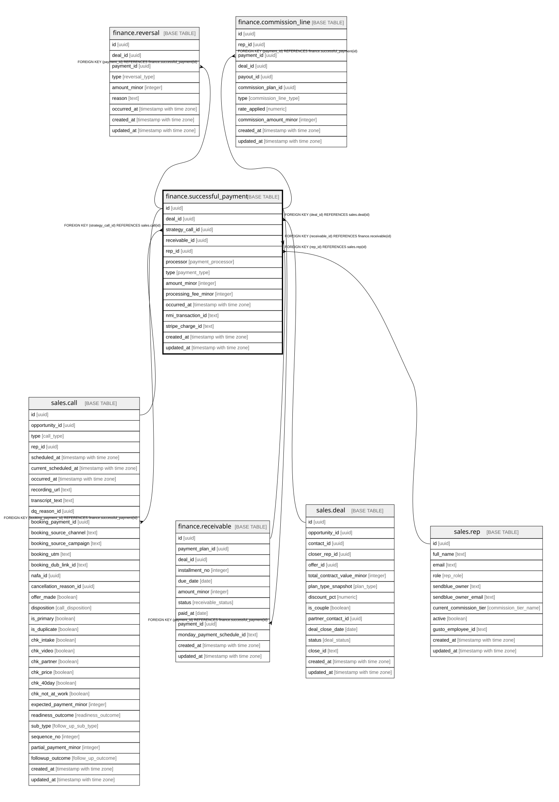

# finance.successful_payment

## Description

A cleared transaction. Cash collected = NMI gross, excludes booking_25, net of reversals.

## Columns

| Name | Type | Default | Nullable | Children | Parents | Comment |
| ---- | ---- | ------- | -------- | -------- | ------- | ------- |
| id | uuid | gen_random_uuid() | false | [sales.call](sales.call.md) [finance.receivable](finance.receivable.md) [finance.reversal](finance.reversal.md) [finance.commission_line](finance.commission_line.md) |  | Primary key (uuid, auto-generated). |
| deal_id | uuid |  | true |  | [sales.deal](sales.deal.md) | Null for the $25 booking fee. |
| strategy_call_id | uuid |  | true |  | [sales.call](sales.call.md) | Set for the $25 booking fee. |
| receivable_id | uuid |  | true |  | [finance.receivable](finance.receivable.md) | The installment this payment fulfils. |
| rep_id | uuid |  | true |  | [sales.rep](sales.rep.md) | For commission attribution. |
| processor | payment_processor |  | false |  |  | stripe (the $25) or nmi (all program payments). |
| type | payment_type |  | false |  |  | booking_25 / deposit / installment / pif. |
| amount_minor | integer |  | false |  |  | Gross amount, in minor units. |
| processing_fee_minor | integer |  | true |  |  | Processor fee (commission is on gross). |
| occurred_at | timestamp with time zone |  | false |  |  | When the payment cleared. |
| nmi_transaction_id | text |  | true |  |  | Cross-system key: the NMI transaction id. |
| stripe_charge_id | text |  | true |  |  | Cross-system key: the Stripe charge id. |
| created_at | timestamp with time zone | now() | false |  |  | When this row was created. |
| updated_at | timestamp with time zone | now() | false |  |  | When this row was last updated (auto-maintained). |

## Constraints

| Name | Type | Definition |
| ---- | ---- | ---------- |
| successful_payment_rep_id_fkey | FOREIGN KEY | FOREIGN KEY (rep_id) REFERENCES sales.rep(id) |
| successful_payment_strategy_call_id_fkey | FOREIGN KEY | FOREIGN KEY (strategy_call_id) REFERENCES sales.call(id) |
| successful_payment_deal_id_fkey | FOREIGN KEY | FOREIGN KEY (deal_id) REFERENCES sales.deal(id) |
| successful_payment_receivable_id_fkey | FOREIGN KEY | FOREIGN KEY (receivable_id) REFERENCES finance.receivable(id) |
| successful_payment_pkey | PRIMARY KEY | PRIMARY KEY (id) |

## Indexes

| Name | Definition |
| ---- | ---------- |
| successful_payment_pkey | CREATE UNIQUE INDEX successful_payment_pkey ON finance.successful_payment USING btree (id) |
| ix_payment_deal | CREATE INDEX ix_payment_deal ON finance.successful_payment USING btree (deal_id) |
| ix_payment_receivable | CREATE INDEX ix_payment_receivable ON finance.successful_payment USING btree (receivable_id) |
| ix_payment_occurred | CREATE INDEX ix_payment_occurred ON finance.successful_payment USING btree (occurred_at) |

## Triggers

| Name | Definition |
| ---- | ---------- |
| trg_successful_payment_updated | CREATE TRIGGER trg_successful_payment_updated BEFORE UPDATE ON finance.successful_payment FOR EACH ROW EXECUTE FUNCTION set_updated_at() |

## Relations

---

> Generated by [tbls](https://github.com/k1LoW/tbls)
