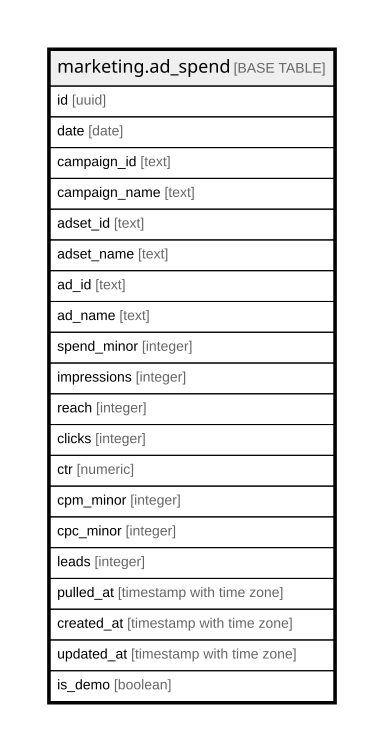

# marketing.ad_spend

## Description

Meta insights, grain = (date x ad_id). Trailing-window upsert by pulled_at for restatements. Lock the ad-account timezone first.

## Columns

| Name | Type | Default | Nullable | Children | Parents | Comment |
| ---- | ---- | ------- | -------- | -------- | ------- | ------- |
| id | uuid | gen_random_uuid() | false |  |  | Primary key (uuid, auto-generated). |
| date | date |  | false |  |  | In the ad-account timezone (lock EST vs PST before loading). |
| campaign_id | text |  | true |  |  | Meta campaign id. |
| campaign_name | text |  | true |  |  | Meta campaign name. |
| adset_id | text |  | true |  |  | Meta adset id. |
| adset_name | text |  | true |  |  | Meta adset name. |
| ad_id | text |  | false |  |  | Grain = (date x ad_id) — the unique key. |
| ad_name | text |  | true |  |  | Meta ad name. |
| spend_minor | integer |  | false |  |  | Spend for the day (minor units). |
| impressions | integer |  | true |  |  | Impressions. |
| reach | integer |  | true |  |  | Reach. |
| clicks | integer |  | true |  |  | Clicks. |
| ctr | numeric |  | true |  |  | Click-through rate. |
| cpm_minor | integer |  | true |  |  | Cost per 1,000 impressions (minor units). |
| cpc_minor | integer |  | true |  |  | Cost per click (minor units). |
| leads | integer |  | true |  |  | Meta-reported leads. |
| pulled_at | timestamp with time zone |  | false |  |  | For restatement — re-pull a trailing window and upsert. |
| created_at | timestamp with time zone | now() | false |  |  | When this row was created. |
| updated_at | timestamp with time zone | now() | false |  |  | When this row was last updated (auto-maintained). |
| is_demo | boolean | false | false |  |  | Demo-mode row (obviously fake data for verifying features). Purge = delete where is_demo. |

## Constraints

| Name | Type | Definition |
| ---- | ---- | ---------- |
| ad_spend_pkey | PRIMARY KEY | PRIMARY KEY (id) |

## Indexes

| Name | Definition |
| ---- | ---------- |
| ad_spend_pkey | CREATE UNIQUE INDEX ad_spend_pkey ON marketing.ad_spend USING btree (id) |
| uq_adspend_grain | CREATE UNIQUE INDEX uq_adspend_grain ON marketing.ad_spend USING btree (date, ad_id) |
| idx_adspend_date | CREATE INDEX idx_adspend_date ON marketing.ad_spend USING btree (date) |

## Triggers

| Name | Definition |
| ---- | ---------- |
| trg_ad_spend_updated | CREATE TRIGGER trg_ad_spend_updated BEFORE UPDATE ON marketing.ad_spend FOR EACH ROW EXECUTE FUNCTION set_updated_at() |

## Relations

---

> Generated by [tbls](https://github.com/k1LoW/tbls)
