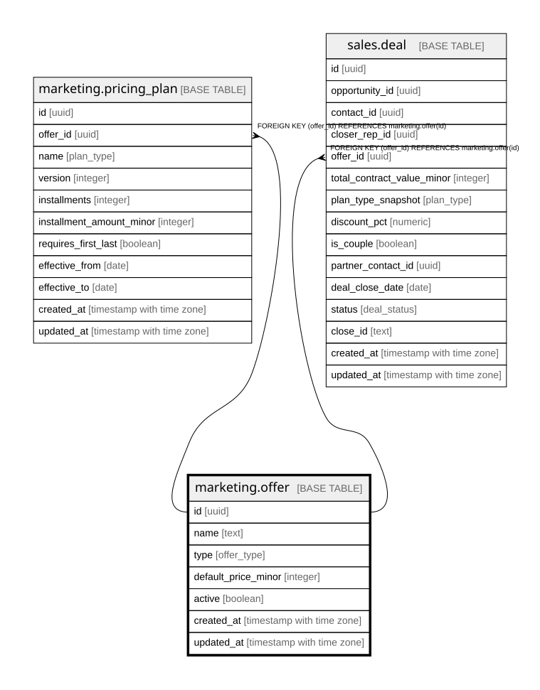

# marketing.offer

## Columns

| Name | Type | Default | Nullable | Children | Parents | Comment |
| ---- | ---- | ------- | -------- | -------- | ------- | ------- |
| id | uuid | gen_random_uuid() | false | [marketing.pricing_plan](marketing.pricing_plan.md) [sales.deal](sales.deal.md) |  | Primary key (uuid, auto-generated). |
| name | text |  | false |  |  | Offer name (BDCR, Coaching, etc.). |
| type | offer_type |  | false |  |  | core / coaching / funding / community / lto / booking_fee. |
| default_price_minor | integer |  | true |  |  | Default price (minor units). |
| active | boolean | true | false |  |  | Whether the offer is currently sold. |
| created_at | timestamp with time zone | now() | false |  |  | When this row was created. |
| updated_at | timestamp with time zone | now() | false |  |  | When this row was last updated (auto-maintained). |

## Constraints

| Name | Type | Definition |
| ---- | ---- | ---------- |
| offer_pkey | PRIMARY KEY | PRIMARY KEY (id) |

## Indexes

| Name | Definition |
| ---- | ---------- |
| offer_pkey | CREATE UNIQUE INDEX offer_pkey ON marketing.offer USING btree (id) |

## Triggers

| Name | Definition |
| ---- | ---------- |
| trg_offer_updated | CREATE TRIGGER trg_offer_updated BEFORE UPDATE ON marketing.offer FOR EACH ROW EXECUTE FUNCTION set_updated_at() |

## Relations

---

> Generated by [tbls](https://github.com/k1LoW/tbls)
