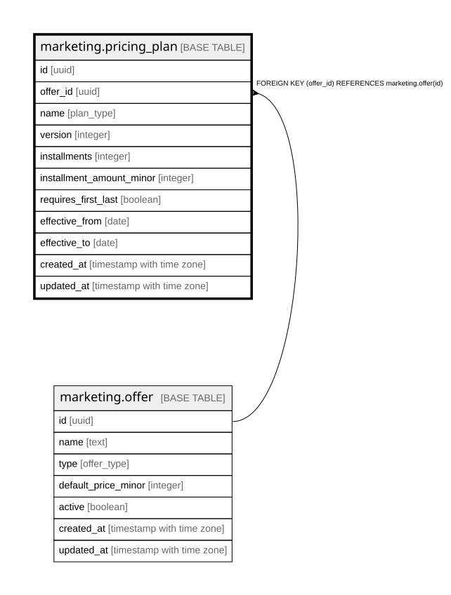

# marketing.pricing_plan

## Columns

| Name | Type | Default | Nullable | Children | Parents | Comment |
| ---- | ---- | ------- | -------- | -------- | ------- | ------- |
| id | uuid | gen_random_uuid() | false |  |  | Primary key (uuid, auto-generated). |
| offer_id | uuid |  | false |  | [marketing.offer](marketing.offer.md) | FK to the offer. |
| name | plan_type |  | false |  |  | Plan name (pif / 3pay / ... / zero_down). |
| version | integer |  | false |  |  | Plan version (the zero-down model changes plans over time). |
| installments | integer |  | true |  |  | Number of installments. |
| installment_amount_minor | integer |  | true |  |  | Per-installment amount (minor units). |
| requires_first_last | boolean |  | true |  |  | The first-and-last-payment-upfront rule. |
| effective_from | date |  | true |  |  | When this plan version takes effect. |
| effective_to | date |  | true |  |  | When this plan version ends. |
| created_at | timestamp with time zone | now() | false |  |  | When this row was created. |
| updated_at | timestamp with time zone | now() | false |  |  | When this row was last updated (auto-maintained). |

## Constraints

| Name | Type | Definition |
| ---- | ---- | ---------- |
| pricing_plan_offer_id_fkey | FOREIGN KEY | FOREIGN KEY (offer_id) REFERENCES marketing.offer(id) |
| pricing_plan_pkey | PRIMARY KEY | PRIMARY KEY (id) |

## Indexes

| Name | Definition |
| ---- | ---------- |
| pricing_plan_pkey | CREATE UNIQUE INDEX pricing_plan_pkey ON marketing.pricing_plan USING btree (id) |

## Triggers

| Name | Definition |
| ---- | ---------- |
| trg_pricing_plan_updated | CREATE TRIGGER trg_pricing_plan_updated BEFORE UPDATE ON marketing.pricing_plan FOR EACH ROW EXECUTE FUNCTION set_updated_at() |

## Relations

---

> Generated by [tbls](https://github.com/k1LoW/tbls)
