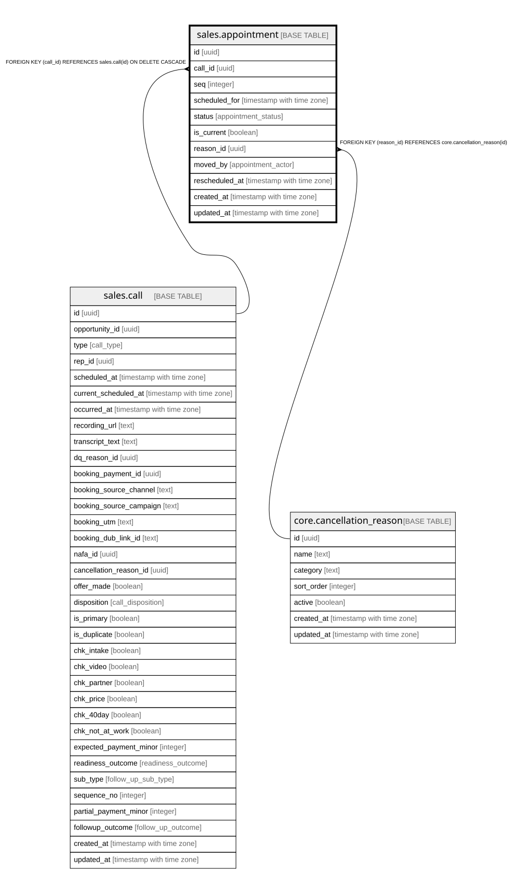

# sales.appointment

## Description

One scheduled slot of a strategy booking. Each reschedule = a new row; terminal slots are immutable. Reschedule = status=rescheduled.

## Columns

| Name | Type | Default | Nullable | Children | Parents | Comment |
| ---- | ---- | ------- | -------- | -------- | ------- | ------- |
| id | uuid | gen_random_uuid() | false |  |  | Primary key (uuid, auto-generated). |
| call_id | uuid |  | false |  | [sales.call](sales.call.md) | FK to the strategy-call booking this slot belongs to. |
| seq | integer |  | false |  |  | 1st / 2nd / 3rd scheduled time for the booking. |
| scheduled_for | timestamp with time zone |  | false |  |  | The appointment date/time (the calendar slot). |
| status | appointment_status | 'scheduled'::appointment_status | false |  |  | This slot's outcome: scheduled (booked) → confirmed / taken / no_show / cancelled_by_* / rescheduled. Terminal slots never change. |
| is_current | boolean | true | false |  |  | The live (latest) slot; exactly one per booking. |
| reason_id | uuid |  | true |  | [core.cancellation_reason](core.cancellation_reason.md) | If rescheduled or cancelled, the reason. |
| moved_by | appointment_actor |  | true |  |  | lead_link (self-serve link) or closer. |
| rescheduled_at | timestamp with time zone |  | true |  |  | When this slot was moved. |
| created_at | timestamp with time zone | now() | false |  |  | When this row was created. |
| updated_at | timestamp with time zone | now() | false |  |  | When this row was last updated (auto-maintained). |

## Constraints

| Name | Type | Definition |
| ---- | ---- | ---------- |
| appointment_reason_id_fkey | FOREIGN KEY | FOREIGN KEY (reason_id) REFERENCES core.cancellation_reason(id) |
| appointment_call_id_fkey | FOREIGN KEY | FOREIGN KEY (call_id) REFERENCES sales.call(id) ON DELETE CASCADE |
| appointment_pkey | PRIMARY KEY | PRIMARY KEY (id) |

## Indexes

| Name | Definition |
| ---- | ---------- |
| appointment_pkey | CREATE UNIQUE INDEX appointment_pkey ON sales.appointment USING btree (id) |
| uq_current_appt | CREATE UNIQUE INDEX uq_current_appt ON sales.appointment USING btree (call_id) WHERE is_current |
| uq_appt_seq | CREATE UNIQUE INDEX uq_appt_seq ON sales.appointment USING btree (call_id, seq) |
| ix_appt_call | CREATE INDEX ix_appt_call ON sales.appointment USING btree (call_id) |
| ix_appt_scheduled_for | CREATE INDEX ix_appt_scheduled_for ON sales.appointment USING btree (scheduled_for) |

## Triggers

| Name | Definition |
| ---- | ---------- |
| trg_appointment_updated | CREATE TRIGGER trg_appointment_updated BEFORE UPDATE ON sales.appointment FOR EACH ROW EXECUTE FUNCTION set_updated_at() |

## Relations

---

> Generated by [tbls](https://github.com/k1LoW/tbls)
