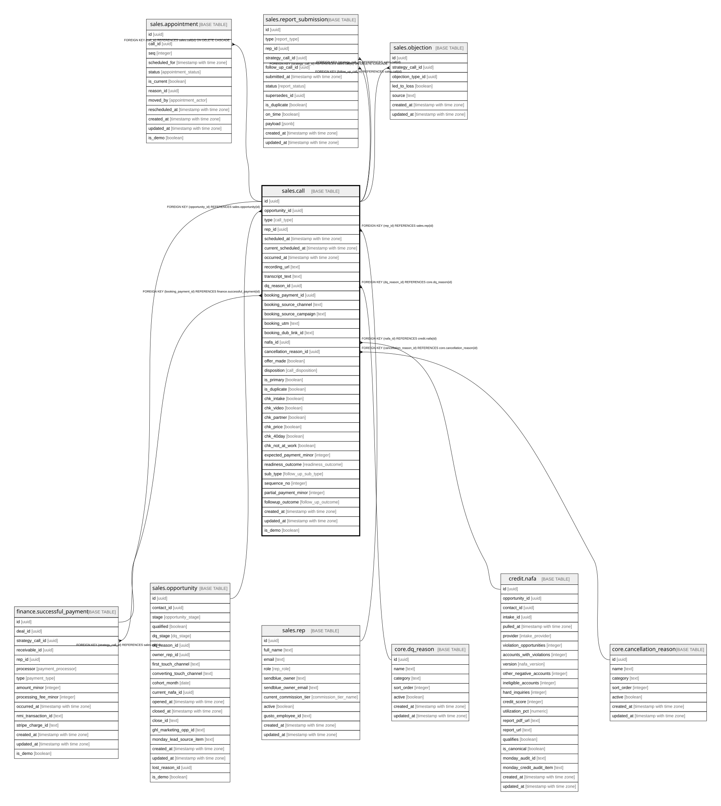

# sales.call

## Description

All calls in one table (type = readiness/strategy/follow_up). The strategy call is the booking; funnel KPIs filter type=strategy.

## Columns

| Name | Type | Default | Nullable | Children | Parents | Comment |
| ---- | ---- | ------- | -------- | -------- | ------- | ------- |
| id | uuid | gen_random_uuid() | false | [sales.appointment](sales.appointment.md) [finance.successful_payment](finance.successful_payment.md) [sales.report_submission](sales.report_submission.md) [sales.objection](sales.objection.md) |  | Primary key (uuid, auto-generated). |
| opportunity_id | uuid |  | false |  | [sales.opportunity](sales.opportunity.md) | FK to the opportunity. |
| type | call_type |  | false |  |  | readiness / strategy / follow_up. The strategy call is the booking; funnel KPIs filter type=strategy. |
| rep_id | uuid |  | true |  | [sales.rep](sales.rep.md) | Owner: setter (readiness) or closer (strategy / follow_up). |
| scheduled_at | timestamp with time zone |  | true |  |  | Original event start. |
| current_scheduled_at | timestamp with time zone |  | true |  |  | After reschedules (the same call moves); the live slot is on appointment. |
| occurred_at | timestamp with time zone |  | true |  |  | When the call was taken. |
| recording_url | text |  | true |  |  | SendBlue recording. |
| transcript_text | text |  | true |  |  | For AI call analysis. |
| dq_reason_id | uuid |  | true |  | [core.dq_reason](core.dq_reason.md) | FK to the disqualification reason (if the outcome was a DQ). |
| booking_payment_id | uuid |  | true |  | [finance.successful_payment](finance.successful_payment.md) | The $25 booking fee (strategy calls). |
| booking_source_channel | text |  | true |  |  | Source of the booking (can differ from the opt-in, e.g. a DM-setter link); = the converting touch. |
| booking_source_campaign | text |  | true |  |  | Campaign that drove the booking (the converting touch). |
| booking_utm | text |  | true |  |  | UTM captured at booking. |
| booking_dub_link_id | text |  | true |  |  | Dub link id captured at booking. |
| nafa_id | uuid |  | true |  | [credit.nafa](credit.nafa.md) | The NAFA used at call time. |
| cancellation_reason_id | uuid |  | true |  | [core.cancellation_reason](core.cancellation_reason.md) | FK to the cancellation reason (if cancelled). |
| offer_made | boolean |  | true |  |  | Was the offer pitched (strategy). |
| disposition | call_disposition |  | true |  |  | Result of a taken strategy call: closed / follow_up / dq_on_call / no_decision. |
| is_primary | boolean |  | true |  |  | The canonical strategy call for the opportunity (exactly one). |
| is_duplicate | boolean | false | true |  |  | Excluded from all KPIs (the extra $25 is refunded). |
| chk_intake | boolean |  | true |  |  | Readiness checklist: intake form submitted. |
| chk_video | boolean |  | true |  |  | Readiness checklist: pre-call video watched. |
| chk_partner | boolean |  | true |  |  | Readiness checklist: partner / spouse handled. |
| chk_price | boolean |  | true |  |  | Readiness checklist: price pre-qualified. |
| chk_40day | boolean |  | true |  |  | Readiness checklist: clear of the 40-day dispute window. |
| chk_not_at_work | boolean |  | true |  |  | Readiness checklist: not at work / not driving at call time. |
| expected_payment_minor | integer |  | true |  |  | Affordability signal from the price pre-qual (readiness). |
| readiness_outcome | readiness_outcome |  | true |  |  | confirmed_ready / reschedule / dq / no_contact (readiness). |
| sub_type | follow_up_sub_type |  | true |  |  | follow_up / enrollment (enrollment = partial-pay-with-a-call-to-follow). |
| sequence_no | integer |  | true |  |  | Which follow-up (2nd, 3rd, ...). |
| partial_payment_minor | integer |  | true |  |  | For enrollment calls. |
| followup_outcome | follow_up_outcome |  | true |  |  | closed / follow_up / dq / no_show / reschedule (follow_up). |
| created_at | timestamp with time zone | now() | false |  |  | When this row was created. |
| updated_at | timestamp with time zone | now() | false |  |  | When this row was last updated (auto-maintained). |

## Constraints

| Name | Type | Definition |
| ---- | ---- | ---------- |
| call_cancellation_reason_id_fkey | FOREIGN KEY | FOREIGN KEY (cancellation_reason_id) REFERENCES core.cancellation_reason(id) |
| call_dq_reason_id_fkey | FOREIGN KEY | FOREIGN KEY (dq_reason_id) REFERENCES core.dq_reason(id) |
| call_rep_id_fkey | FOREIGN KEY | FOREIGN KEY (rep_id) REFERENCES sales.rep(id) |
| call_opportunity_id_fkey | FOREIGN KEY | FOREIGN KEY (opportunity_id) REFERENCES sales.opportunity(id) |
| call_nafa_fk | FOREIGN KEY | FOREIGN KEY (nafa_id) REFERENCES credit.nafa(id) |
| call_pkey | PRIMARY KEY | PRIMARY KEY (id) |
| call_booking_payment_fk | FOREIGN KEY | FOREIGN KEY (booking_payment_id) REFERENCES finance.successful_payment(id) |

## Indexes

| Name | Definition |
| ---- | ---------- |
| call_pkey | CREATE UNIQUE INDEX call_pkey ON sales.call USING btree (id) |
| uq_primary_strategy | CREATE UNIQUE INDEX uq_primary_strategy ON sales.call USING btree (opportunity_id) WHERE ((type = 'strategy'::call_type) AND is_primary) |
| ix_call_opp | CREATE INDEX ix_call_opp ON sales.call USING btree (opportunity_id) |

## Triggers

| Name | Definition |
| ---- | ---------- |
| trg_call_updated | CREATE TRIGGER trg_call_updated BEFORE UPDATE ON sales.call FOR EACH ROW EXECUTE FUNCTION set_updated_at() |

## Relations

---

> Generated by [tbls](https://github.com/k1LoW/tbls)
