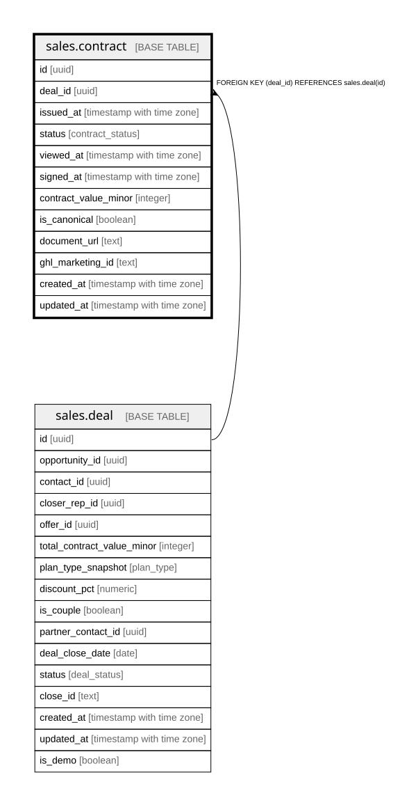

# sales.contract

## Columns

| Name | Type | Default | Nullable | Children | Parents | Comment |
| ---- | ---- | ------- | -------- | -------- | ------- | ------- |
| id | uuid | gen_random_uuid() | false |  |  | Primary key (uuid, auto-generated). |
| deal_id | uuid |  | false |  | [sales.deal](sales.deal.md) | FK to the deal. |
| issued_at | timestamp with time zone |  | true |  |  | When the agreement was issued. |
| status | contract_status | 'sent'::contract_status | false |  |  | sent / viewed / completed / void. |
| viewed_at | timestamp with time zone |  | true |  |  | When viewed — the honesty signal. |
| signed_at | timestamp with time zone |  | true |  |  | When the agreement was signed. |
| contract_value_minor | integer |  | true |  |  | The contract value in this version (minor units). |
| is_canonical | boolean | true | false |  |  | The latest signed contract = canonical. |
| document_url | text |  | true |  |  | Link to the agreement document. |
| ghl_marketing_id | text |  | true |  |  | Cross-system key: the contract id in GHL Marketing. |
| created_at | timestamp with time zone | now() | false |  |  | When this row was created. |
| updated_at | timestamp with time zone | now() | false |  |  | When this row was last updated (auto-maintained). |

## Constraints

| Name | Type | Definition |
| ---- | ---- | ---------- |
| contract_deal_id_fkey | FOREIGN KEY | FOREIGN KEY (deal_id) REFERENCES sales.deal(id) |
| contract_pkey | PRIMARY KEY | PRIMARY KEY (id) |

## Indexes

| Name | Definition |
| ---- | ---------- |
| contract_pkey | CREATE UNIQUE INDEX contract_pkey ON sales.contract USING btree (id) |
| uq_canonical_contract | CREATE UNIQUE INDEX uq_canonical_contract ON sales.contract USING btree (deal_id) WHERE is_canonical |
| ix_contract_deal | CREATE INDEX ix_contract_deal ON sales.contract USING btree (deal_id) |

## Triggers

| Name | Definition |
| ---- | ---------- |
| trg_contract_updated | CREATE TRIGGER trg_contract_updated BEFORE UPDATE ON sales.contract FOR EACH ROW EXECUTE FUNCTION set_updated_at() |

## Relations

---

> Generated by [tbls](https://github.com/k1LoW/tbls)
