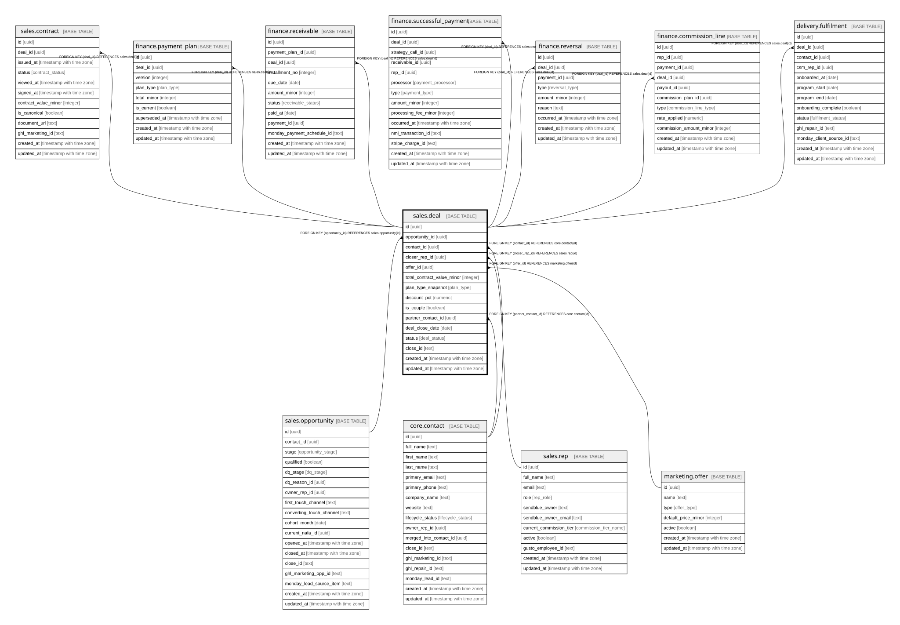

# sales.deal

## Description

A won opportunity + terms. Always one offer per deal. status never deleted.

## Columns

| Name | Type | Default | Nullable | Children | Parents | Comment |
| ---- | ---- | ------- | -------- | -------- | ------- | ------- |
| id | uuid | gen_random_uuid() | false | [sales.contract](sales.contract.md) [finance.payment_plan](finance.payment_plan.md) [finance.receivable](finance.receivable.md) [finance.successful_payment](finance.successful_payment.md) [finance.reversal](finance.reversal.md) [finance.commission_line](finance.commission_line.md) [delivery.fulfilment](delivery.fulfilment.md) |  | Primary key (uuid, auto-generated). |
| opportunity_id | uuid |  | false |  | [sales.opportunity](sales.opportunity.md) | FK to the won opportunity. |
| contact_id | uuid |  | false |  | [core.contact](core.contact.md) | FK to the contact (the buyer). |
| closer_rep_id | uuid |  | true |  | [sales.rep](sales.rep.md) | FK to the closer who won it. |
| offer_id | uuid |  | false |  | [marketing.offer](marketing.offer.md) | The single offer sold — always one offer per deal. |
| total_contract_value_minor | integer |  | false |  |  | Booked revenue (contract value), in minor units. |
| plan_type_snapshot | plan_type |  | true |  |  | The plan as sold — a frozen snapshot, not a pointer to a mutable plan. |
| discount_pct | numeric |  | true |  |  | Discount applied (e.g. for couples). |
| is_couple | boolean | false | true |  |  | True if a couple enrolled together. |
| partner_contact_id | uuid |  | true |  | [core.contact](core.contact.md) | The other person, for couples. |
| deal_close_date | date |  | false |  |  | The moment the opportunity was marked Won (the deal-close date). |
| status | deal_status | 'active'::deal_status | false |  |  | active / refunded / churned. Never deleted. |
| close_id | text |  | true |  |  | Cross-system key: the opportunity/deal id in Close. |
| created_at | timestamp with time zone | now() | false |  |  | When this row was created. |
| updated_at | timestamp with time zone | now() | false |  |  | When this row was last updated (auto-maintained). |
| is_demo | boolean | false | false |  |  | Demo-mode row (obviously fake data for verifying features). Purge = delete where is_demo. |

## Constraints

| Name | Type | Definition |
| ---- | ---- | ---------- |
| deal_closer_rep_id_fkey | FOREIGN KEY | FOREIGN KEY (closer_rep_id) REFERENCES sales.rep(id) |
| deal_contact_id_fkey | FOREIGN KEY | FOREIGN KEY (contact_id) REFERENCES core.contact(id) |
| deal_partner_contact_id_fkey | FOREIGN KEY | FOREIGN KEY (partner_contact_id) REFERENCES core.contact(id) |
| deal_offer_id_fkey | FOREIGN KEY | FOREIGN KEY (offer_id) REFERENCES marketing.offer(id) |
| deal_opportunity_id_fkey | FOREIGN KEY | FOREIGN KEY (opportunity_id) REFERENCES sales.opportunity(id) |
| deal_pkey | PRIMARY KEY | PRIMARY KEY (id) |

## Indexes

| Name | Definition |
| ---- | ---------- |
| deal_pkey | CREATE UNIQUE INDEX deal_pkey ON sales.deal USING btree (id) |
| uq_deal_per_opp | CREATE UNIQUE INDEX uq_deal_per_opp ON sales.deal USING btree (opportunity_id) |
| ix_deal_opp | CREATE INDEX ix_deal_opp ON sales.deal USING btree (opportunity_id) |
| ix_deal_contact | CREATE INDEX ix_deal_contact ON sales.deal USING btree (contact_id) |

## Triggers

| Name | Definition |
| ---- | ---------- |
| trg_deal_updated | CREATE TRIGGER trg_deal_updated BEFORE UPDATE ON sales.deal FOR EACH ROW EXECUTE FUNCTION set_updated_at() |

## Relations

---

> Generated by [tbls](https://github.com/k1LoW/tbls)
