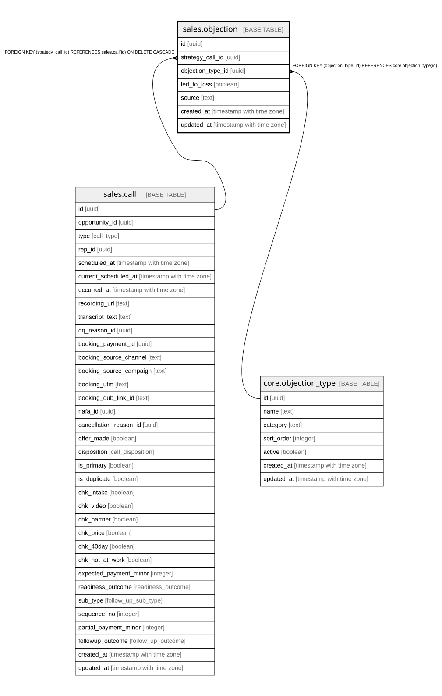

# sales.objection

## Columns

| Name | Type | Default | Nullable | Children | Parents | Comment |
| ---- | ---- | ------- | -------- | -------- | ------- | ------- |
| id | uuid | gen_random_uuid() | false |  |  | Primary key (uuid, auto-generated). |
| strategy_call_id | uuid |  | false |  | [sales.call](sales.call.md) | FK to the strategy call where the objection arose. |
| objection_type_id | uuid |  | true |  | [core.objection_type](core.objection_type.md) | FK to the objection_type taxonomy. |
| led_to_loss | boolean |  | true |  |  | Did this objection cause the loss. |
| source | text |  | true |  |  | rep_logged or ai_extracted. |
| created_at | timestamp with time zone | now() | false |  |  | When this row was created. |
| updated_at | timestamp with time zone | now() | false |  |  | When this row was last updated (auto-maintained). |

## Constraints

| Name | Type | Definition |
| ---- | ---- | ---------- |
| objection_objection_type_id_fkey | FOREIGN KEY | FOREIGN KEY (objection_type_id) REFERENCES core.objection_type(id) |
| objection_strategy_call_id_fkey | FOREIGN KEY | FOREIGN KEY (strategy_call_id) REFERENCES sales.call(id) ON DELETE CASCADE |
| objection_pkey | PRIMARY KEY | PRIMARY KEY (id) |

## Indexes

| Name | Definition |
| ---- | ---------- |
| objection_pkey | CREATE UNIQUE INDEX objection_pkey ON sales.objection USING btree (id) |

## Triggers

| Name | Definition |
| ---- | ---------- |
| trg_objection_updated | CREATE TRIGGER trg_objection_updated BEFORE UPDATE ON sales.objection FOR EACH ROW EXECUTE FUNCTION set_updated_at() |

## Relations

---

> Generated by [tbls](https://github.com/k1LoW/tbls)
