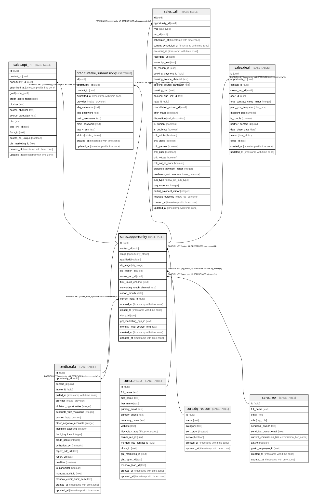

# sales.opportunity

## Description

A sales-cycle instance and the main reporting unit. Contact : Opportunity = 1:N — a contact can have multiple opportunities over time (repeat purchases) and more than one may be open at once; the database mirrors Close. The automation works with one active opportunity at a time and never OVERWRITES a won opportunity (it creates a new one for new activity), but that is sync/automation logic, NOT a database rule — an opportunity created by hand in Close syncs straight through.

## Columns

| Name | Type | Default | Nullable | Children | Parents | Comment |
| ---- | ---- | ------- | -------- | -------- | ------- | ------- |
| id | uuid | gen_random_uuid() | false | [sales.opt_in](sales.opt_in.md) [credit.intake_submission](credit.intake_submission.md) [credit.nafa](credit.nafa.md) [sales.call](sales.call.md) [sales.deal](sales.deal.md) |  | Primary key (uuid, auto-generated). |
| contact_id | uuid |  | false |  | [core.contact](core.contact.md) | FK to the contact. |
| stage | opportunity_stage | 'lead_opt_in'::opportunity_stage | false |  |  | The Close pipeline stage — a faithful mirror of Close (the system of record). Users may move an opportunity to any stage, in any direction, and this reflects it. The discipline that our automations never OVERWRITE a won opportunity (they create a NEW opportunity for new activity instead) is enforced in the sync/automation layer, NOT by a database constraint. Reaching won_pif or won_pp triggers client onboarding (a fulfilment record). ACTIVE: lead_opt_in, strategy_call_booked, intake_form_submitted, audit_complete, intake_form_needed, call_confirmed, no_show, call_canceled_by_lead, follow_up_call_booked, warm_list, contract_sent, contract_signed. WON: deposit, won_pif, won_pp. LOST: call_canceled_by_team, lost, dq_on_call. |
| qualified | boolean | true | false |  |  | Default true until disqualified. |
| dq_stage | dq_stage |  | true |  |  | Where disqualification happened: setting or closing. |
| dq_reason_id | uuid |  | true |  | [core.dq_reason](core.dq_reason.md) | FK to the disqualification reason (if disqualified). |
| owner_rep_id | uuid |  | true |  | [sales.rep](sales.rep.md) | FK to the owning rep. |
| first_touch_channel | text |  | true |  |  | Snapshot at close: the first opt-in source (how acquired). The Deal inherits it. |
| converting_touch_channel | text |  | true |  |  | Snapshot at close: the booking source (what closed them). The Deal inherits it. |
| cohort_month | date |  | true |  |  | Opt-in / book month, for cohorting lead quality. |
| current_nafa_id | uuid |  | true |  | [credit.nafa](credit.nafa.md) | The latest valid NAFA. |
| opened_at | timestamp with time zone |  | true |  |  | When the opportunity was opened. |
| closed_at | timestamp with time zone |  | true |  |  | When the opportunity was closed (won or lost). |
| close_id | text |  | true |  |  | Cross-system key: the opportunity id in Close. |
| ghl_marketing_opp_id | text |  | true |  |  | Cross-system key: the opportunity id in GHL Marketing. |
| monday_lead_source_item | text |  | true |  |  | Cross-system key: the Monday lead-source item. |
| created_at | timestamp with time zone | now() | false |  |  | When this row was created. |
| updated_at | timestamp with time zone | now() | false |  |  | When this row was last updated (auto-maintained). |
| lost_reason_id | uuid |  | true |  | [core.lost_reason](core.lost_reason.md) | FK to the lost reason (why a qualified lead did not convert). dq_reason_id covers screened-out leads. |
| is_demo | boolean | false | false |  |  | Demo-mode row (obviously fake data for verifying features). Purge = delete where is_demo. |

## Constraints

| Name | Type | Definition |
| ---- | ---- | ---------- |
| opportunity_dq_reason_id_fkey | FOREIGN KEY | FOREIGN KEY (dq_reason_id) REFERENCES core.dq_reason(id) |
| opportunity_owner_rep_id_fkey | FOREIGN KEY | FOREIGN KEY (owner_rep_id) REFERENCES sales.rep(id) |
| opportunity_contact_id_fkey | FOREIGN KEY | FOREIGN KEY (contact_id) REFERENCES core.contact(id) |
| opportunity_pkey | PRIMARY KEY | PRIMARY KEY (id) |
| opportunity_current_nafa_fk | FOREIGN KEY | FOREIGN KEY (current_nafa_id) REFERENCES credit.nafa(id) |
| opportunity_lost_reason_id_fkey | FOREIGN KEY | FOREIGN KEY (lost_reason_id) REFERENCES core.lost_reason(id) |

## Indexes

| Name | Definition |
| ---- | ---------- |
| opportunity_pkey | CREATE UNIQUE INDEX opportunity_pkey ON sales.opportunity USING btree (id) |
| ix_opp_contact | CREATE INDEX ix_opp_contact ON sales.opportunity USING btree (contact_id) |
| idx_opportunity_stage | CREATE INDEX idx_opportunity_stage ON sales.opportunity USING btree (stage) |
| idx_opportunity_opened | CREATE INDEX idx_opportunity_opened ON sales.opportunity USING btree (opened_at) |

## Triggers

| Name | Definition |
| ---- | ---------- |
| trg_opportunity_updated | CREATE TRIGGER trg_opportunity_updated BEFORE UPDATE ON sales.opportunity FOR EACH ROW EXECUTE FUNCTION set_updated_at() |

## Relations

---

> Generated by [tbls](https://github.com/k1LoW/tbls)
