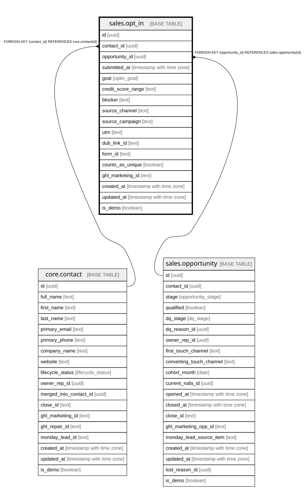

# sales.opt_in

## Description

A marketing lead-form submission. Carries the source that feeds first-touch.

## Columns

| Name | Type | Default | Nullable | Children | Parents | Comment |
| ---- | ---- | ------- | -------- | -------- | ------- | ------- |
| id | uuid | gen_random_uuid() | false |  |  | Primary key (uuid, auto-generated). |
| contact_id | uuid |  | false |  | [core.contact](core.contact.md) | FK to the contact who submitted. |
| opportunity_id | uuid |  | true |  | [sales.opportunity](sales.opportunity.md) | FK to the opportunity this opt-in belongs to. |
| submitted_at | timestamp with time zone |  | false |  |  | When the form was submitted. |
| goal | optin_goal |  | true |  |  | What the lead wants: house / car / credit_cards / business_credit / other. |
| credit_score_range | text |  | true |  |  | Self-reported range. |
| blocker | text |  | true |  |  | What has held them back. |
| source_channel | text |  | true |  |  | Source of this opt-in (via Dub); feeds first-touch. |
| source_campaign | text |  | true |  |  | The campaign that drove this opt-in (via Dub). |
| utm | text |  | true |  |  | UTM parameters captured at opt-in. |
| dub_link_id | text |  | true |  |  | Dub link identifier for this opt-in. |
| form_id | text |  | true |  |  | Which GHL form was submitted. |
| counts_as_unique | boolean | true | false |  |  | Derived; applies the \>30-day re-count rule. |
| ghl_marketing_id | text |  | true |  |  | Cross-system key: the submission id in GHL Marketing. |
| created_at | timestamp with time zone | now() | false |  |  | When this row was created. |
| updated_at | timestamp with time zone | now() | false |  |  | When this row was last updated (auto-maintained). |
| is_demo | boolean | false | false |  |  | Demo-mode row (obviously fake data for verifying features). Purge = delete where is_demo. |

## Constraints

| Name | Type | Definition |
| ---- | ---- | ---------- |
| opt_in_contact_id_fkey | FOREIGN KEY | FOREIGN KEY (contact_id) REFERENCES core.contact(id) |
| opt_in_opportunity_id_fkey | FOREIGN KEY | FOREIGN KEY (opportunity_id) REFERENCES sales.opportunity(id) |
| opt_in_pkey | PRIMARY KEY | PRIMARY KEY (id) |

## Indexes

| Name | Definition |
| ---- | ---------- |
| opt_in_pkey | CREATE UNIQUE INDEX opt_in_pkey ON sales.opt_in USING btree (id) |
| ix_optin_contact | CREATE INDEX ix_optin_contact ON sales.opt_in USING btree (contact_id) |
| ix_optin_opp | CREATE INDEX ix_optin_opp ON sales.opt_in USING btree (opportunity_id) |
| idx_optin_submitted | CREATE INDEX idx_optin_submitted ON sales.opt_in USING btree (submitted_at) |

## Triggers

| Name | Definition |
| ---- | ---------- |
| trg_opt_in_updated | CREATE TRIGGER trg_opt_in_updated BEFORE UPDATE ON sales.opt_in FOR EACH ROW EXECUTE FUNCTION set_updated_at() |

## Relations

---

> Generated by [tbls](https://github.com/k1LoW/tbls)
