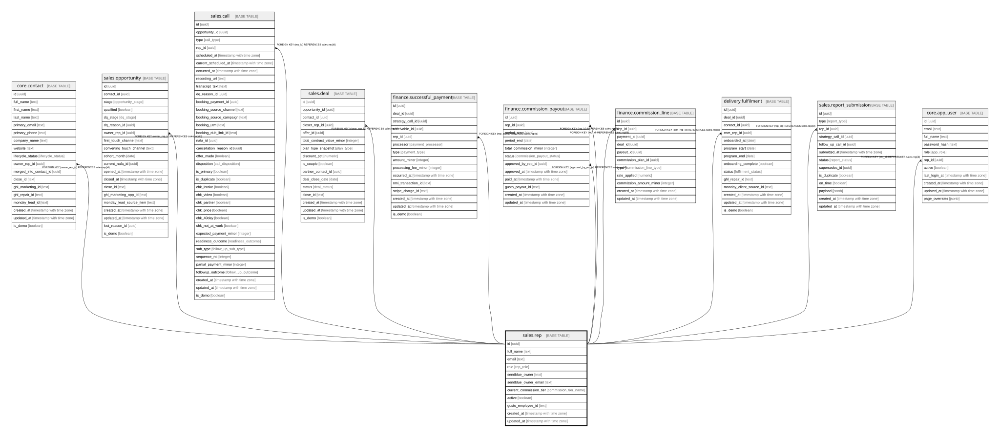

# sales.rep

## Columns

| Name | Type | Default | Nullable | Children | Parents | Comment |
| ---- | ---- | ------- | -------- | -------- | ------- | ------- |
| id | uuid | gen_random_uuid() | false | [core.contact](core.contact.md) [sales.opportunity](sales.opportunity.md) [sales.call](sales.call.md) [sales.deal](sales.deal.md) [finance.successful_payment](finance.successful_payment.md) [finance.commission_payout](finance.commission_payout.md) [finance.commission_line](finance.commission_line.md) [delivery.fulfilment](delivery.fulfilment.md) [sales.report_submission](sales.report_submission.md) |  | Primary key (uuid, auto-generated). |
| full_name | text |  | false |  |  | The team member's full name. |
| email | text |  | true |  |  | The team member's email. |
| role | rep_role |  | false |  |  | setter / closer / hybrid / csm / admin. |
| sendblue_owner | text |  | true |  |  | SendBlue owner handle (matches calls to this rep). |
| sendblue_owner_email | text |  | true |  |  | SendBlue owner email (matches calls to this rep). |
| current_commission_tier | commission_tier_name |  | true |  |  | Derived from the rep's rolling 2-week close rate. |
| active | boolean | true | false |  |  | Whether the rep is currently active. |
| gusto_employee_id | text |  | true |  |  | Payroll (Gusto). |
| created_at | timestamp with time zone | now() | false |  |  | When this row was created. |
| updated_at | timestamp with time zone | now() | false |  |  | When this row was last updated (auto-maintained). |

## Constraints

| Name | Type | Definition |
| ---- | ---- | ---------- |
| rep_pkey | PRIMARY KEY | PRIMARY KEY (id) |

## Indexes

| Name | Definition |
| ---- | ---------- |
| rep_pkey | CREATE UNIQUE INDEX rep_pkey ON sales.rep USING btree (id) |

## Triggers

| Name | Definition |
| ---- | ---------- |
| trg_rep_updated | CREATE TRIGGER trg_rep_updated BEFORE UPDATE ON sales.rep FOR EACH ROW EXECUTE FUNCTION set_updated_at() |

## Relations

---

> Generated by [tbls](https://github.com/k1LoW/tbls)
