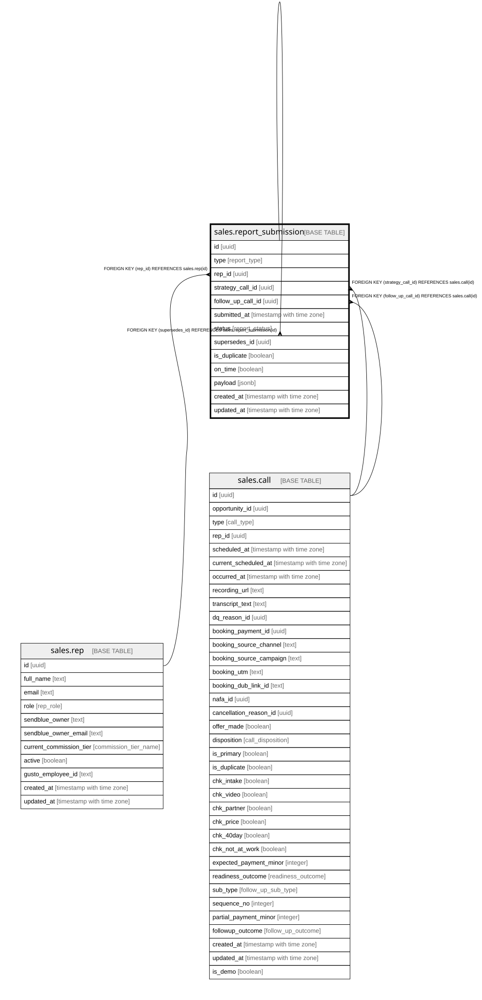

# sales.report_submission

## Columns

| Name | Type | Default | Nullable | Children | Parents | Comment |
| ---- | ---- | ------- | -------- | -------- | ------- | ------- |
| id | uuid | gen_random_uuid() | false | [sales.report_submission](sales.report_submission.md) |  | Primary key (uuid, auto-generated). |
| type | report_type |  | false |  |  | sales_call / missed_call / post_call_notes. |
| rep_id | uuid |  | false |  | [sales.rep](sales.rep.md) | FK to the rep who submitted. |
| strategy_call_id | uuid |  | true |  | [sales.call](sales.call.md) | FK to the strategy call (if a strategy-call report). |
| follow_up_call_id | uuid |  | true |  | [sales.call](sales.call.md) | FK to the follow-up call (if a follow-up report). |
| submitted_at | timestamp with time zone |  | false |  |  | When the report was submitted. |
| status | report_status | 'submitted'::report_status | false |  |  | submitted / validated / superseded / rejected. |
| supersedes_id | uuid |  | true |  | [sales.report_submission](sales.report_submission.md) | The prior submission this one corrects. |
| is_duplicate | boolean | false | true |  |  | Flagged if this is a duplicate submission. |
| on_time | boolean |  | true |  |  | For the report-submission-compliance KPI. |
| payload | jsonb |  | true |  |  | The raw submission (jsonb). |
| created_at | timestamp with time zone | now() | false |  |  | When this row was created. |
| updated_at | timestamp with time zone | now() | false |  |  | When this row was last updated (auto-maintained). |

## Constraints

| Name | Type | Definition |
| ---- | ---- | ---------- |
| report_submission_rep_id_fkey | FOREIGN KEY | FOREIGN KEY (rep_id) REFERENCES sales.rep(id) |
| report_submission_follow_up_call_id_fkey | FOREIGN KEY | FOREIGN KEY (follow_up_call_id) REFERENCES sales.call(id) |
| report_submission_strategy_call_id_fkey | FOREIGN KEY | FOREIGN KEY (strategy_call_id) REFERENCES sales.call(id) |
| report_submission_pkey | PRIMARY KEY | PRIMARY KEY (id) |
| report_submission_supersedes_id_fkey | FOREIGN KEY | FOREIGN KEY (supersedes_id) REFERENCES sales.report_submission(id) |

## Indexes

| Name | Definition |
| ---- | ---------- |
| report_submission_pkey | CREATE UNIQUE INDEX report_submission_pkey ON sales.report_submission USING btree (id) |
| ix_report_strategy_call | CREATE INDEX ix_report_strategy_call ON sales.report_submission USING btree (strategy_call_id) |

## Triggers

| Name | Definition |
| ---- | ---------- |
| trg_report_submission_updated | CREATE TRIGGER trg_report_submission_updated BEFORE UPDATE ON sales.report_submission FOR EACH ROW EXECUTE FUNCTION set_updated_at() |

## Relations

---

> Generated by [tbls](https://github.com/k1LoW/tbls)
