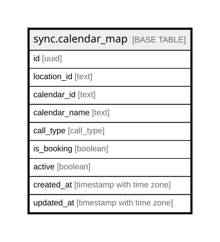

# sync.calendar_map

## Description

GHL calendar -> call type mapping. The GHL sync categorizes every appointment through this; edited in the admin panel. Unmapped calendars default to strategy and appear here automatically for review.

## Columns

| Name | Type | Default | Nullable | Children | Parents | Comment |
| ---- | ---- | ------- | -------- | -------- | ------- | ------- |
| id | uuid | gen_random_uuid() | false |  |  | Primary key (uuid, auto-generated). |
| location_id | text |  | false |  |  | GHL sub-account (location) id the calendar belongs to. |
| calendar_id | text |  | false |  |  | GHL calendar id. |
| calendar_name | text |  | true |  |  | Human-readable calendar name (auto-filled from events, editable). |
| call_type | call_type | 'strategy'::call_type | false |  |  | Which call type bookings on this calendar create: readiness / strategy / follow_up. |
| is_booking | boolean | true | false |  |  | Whether bookings on this calendar count toward the "booked" funnel KPIs (true for paid strategy calendars). |
| active | boolean | true | false |  |  | Whether this mapping is in use. |
| created_at | timestamp with time zone | now() | false |  |  | When this row was created. |
| updated_at | timestamp with time zone | now() | false |  |  | When this row was last updated (auto-maintained). |

## Constraints

| Name | Type | Definition |
| ---- | ---- | ---------- |
| calendar_map_pkey | PRIMARY KEY | PRIMARY KEY (id) |
| calendar_map_location_id_calendar_id_key | UNIQUE | UNIQUE (location_id, calendar_id) |

## Indexes

| Name | Definition |
| ---- | ---------- |
| calendar_map_pkey | CREATE UNIQUE INDEX calendar_map_pkey ON sync.calendar_map USING btree (id) |
| calendar_map_location_id_calendar_id_key | CREATE UNIQUE INDEX calendar_map_location_id_calendar_id_key ON sync.calendar_map USING btree (location_id, calendar_id) |

## Triggers

| Name | Definition |
| ---- | ---------- |
| trg_calendar_map_updated | CREATE TRIGGER trg_calendar_map_updated BEFORE UPDATE ON sync.calendar_map FOR EACH ROW EXECUTE FUNCTION set_updated_at() |

## Relations

---

> Generated by [tbls](https://github.com/k1LoW/tbls)
