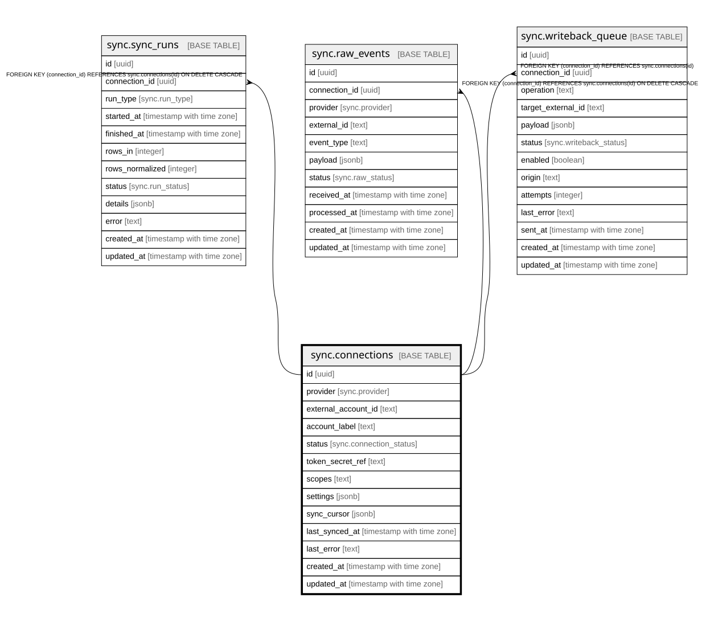

# sync.connections

## Description

One row per connected account. Adding an account is a new row — this is what makes the connectors dynamic / multi-account. One GHL agency can have many location rows. OAuth tokens live in Supabase Vault (token_secret_ref), never inline.

## Columns

| Name | Type | Default | Nullable | Children | Parents | Comment |
| ---- | ---- | ------- | -------- | -------- | ------- | ------- |
| id | uuid | gen_random_uuid() | false | [sync.sync_runs](sync.sync_runs.md) [sync.raw_events](sync.raw_events.md) [sync.writeback_queue](sync.writeback_queue.md) |  |  |
| provider | sync.provider |  | false |  |  |  |
| external_account_id | text |  | false |  |  |  |
| account_label | text |  | true |  |  |  |
| status | sync.connection_status | 'connected'::sync.connection_status | false |  |  |  |
| token_secret_ref | text |  | true |  |  |  |
| scopes | text |  | true |  |  |  |
| settings | jsonb | '{}'::jsonb | false |  |  |  |
| sync_cursor | jsonb | '{}'::jsonb | false |  |  |  |
| last_synced_at | timestamp with time zone |  | true |  |  |  |
| last_error | text |  | true |  |  |  |
| created_at | timestamp with time zone | now() | false |  |  |  |
| updated_at | timestamp with time zone | now() | false |  |  |  |

## Constraints

| Name | Type | Definition |
| ---- | ---- | ---------- |
| connections_pkey | PRIMARY KEY | PRIMARY KEY (id) |
| connections_provider_external_account_id_key | UNIQUE | UNIQUE (provider, external_account_id) |

## Indexes

| Name | Definition |
| ---- | ---------- |
| connections_pkey | CREATE UNIQUE INDEX connections_pkey ON sync.connections USING btree (id) |
| connections_provider_external_account_id_key | CREATE UNIQUE INDEX connections_provider_external_account_id_key ON sync.connections USING btree (provider, external_account_id) |

## Triggers

| Name | Definition |
| ---- | ---------- |
| trg_connections_updated | CREATE TRIGGER trg_connections_updated BEFORE UPDATE ON sync.connections FOR EACH ROW EXECUTE FUNCTION set_updated_at() |

## Relations

---

> Generated by [tbls](https://github.com/k1LoW/tbls)
