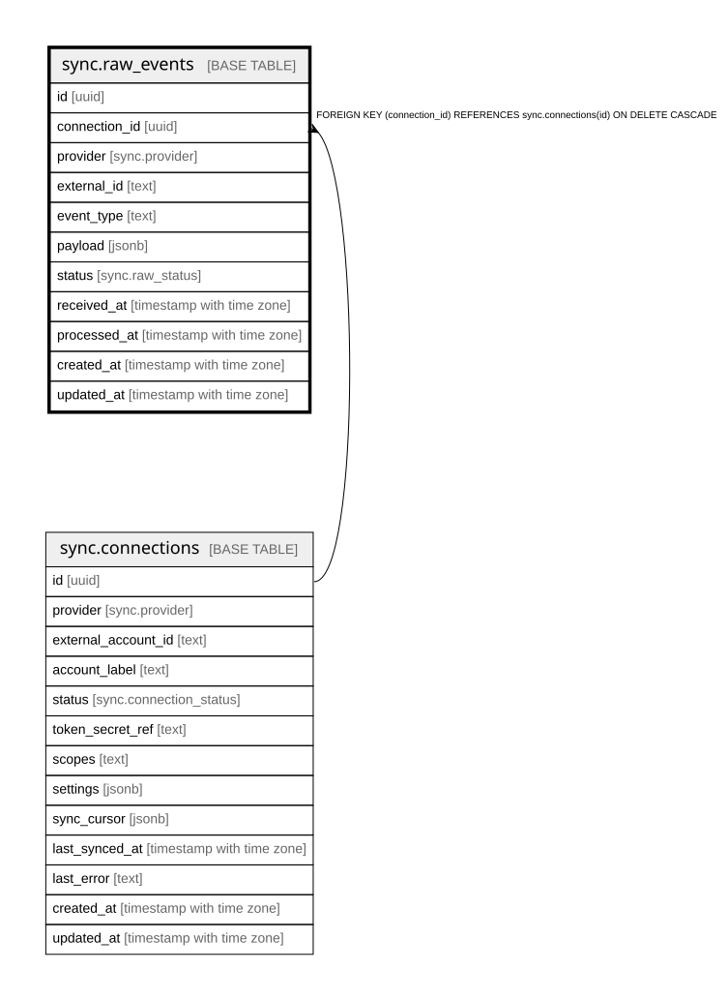

# sync.raw_events

## Description

Idempotent landing zone for raw provider payloads. The UNIQUE key makes a re-delivered webhook or a re-pulled record a no-op.

## Columns

| Name | Type | Default | Nullable | Children | Parents | Comment |
| ---- | ---- | ------- | -------- | -------- | ------- | ------- |
| id | uuid | gen_random_uuid() | false |  |  |  |
| connection_id | uuid |  | false |  | [sync.connections](sync.connections.md) |  |
| provider | sync.provider |  | false |  |  |  |
| external_id | text |  | false |  |  |  |
| event_type | text |  | false |  |  |  |
| payload | jsonb |  | false |  |  |  |
| status | sync.raw_status | 'pending'::sync.raw_status | false |  |  |  |
| received_at | timestamp with time zone | now() | false |  |  |  |
| processed_at | timestamp with time zone |  | true |  |  |  |
| created_at | timestamp with time zone | now() | false |  |  |  |
| updated_at | timestamp with time zone | now() | false |  |  |  |

## Constraints

| Name | Type | Definition |
| ---- | ---- | ---------- |
| raw_events_connection_id_fkey | FOREIGN KEY | FOREIGN KEY (connection_id) REFERENCES sync.connections(id) ON DELETE CASCADE |
| raw_events_pkey | PRIMARY KEY | PRIMARY KEY (id) |
| raw_events_connection_id_external_id_event_type_key | UNIQUE | UNIQUE (connection_id, external_id, event_type) |

## Indexes

| Name | Definition |
| ---- | ---------- |
| raw_events_pkey | CREATE UNIQUE INDEX raw_events_pkey ON sync.raw_events USING btree (id) |
| raw_events_connection_id_external_id_event_type_key | CREATE UNIQUE INDEX raw_events_connection_id_external_id_event_type_key ON sync.raw_events USING btree (connection_id, external_id, event_type) |
| idx_rawevents_status | CREATE INDEX idx_rawevents_status ON sync.raw_events USING btree (status) |

## Triggers

| Name | Definition |
| ---- | ---------- |
| trg_raw_events_updated | CREATE TRIGGER trg_raw_events_updated BEFORE UPDATE ON sync.raw_events FOR EACH ROW EXECUTE FUNCTION set_updated_at() |

## Relations

---

> Generated by [tbls](https://github.com/k1LoW/tbls)
