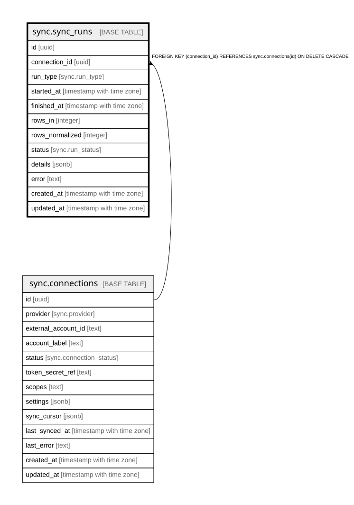

# sync.sync_runs

## Columns

| Name | Type | Default | Nullable | Children | Parents | Comment |
| ---- | ---- | ------- | -------- | -------- | ------- | ------- |
| id | uuid | gen_random_uuid() | false |  |  |  |
| connection_id | uuid |  | false |  | [sync.connections](sync.connections.md) |  |
| run_type | sync.run_type |  | false |  |  |  |
| started_at | timestamp with time zone | now() | false |  |  |  |
| finished_at | timestamp with time zone |  | true |  |  |  |
| rows_in | integer |  | true |  |  |  |
| rows_normalized | integer |  | true |  |  |  |
| status | sync.run_status | 'running'::sync.run_status | false |  |  |  |
| details | jsonb |  | true |  |  |  |
| error | text |  | true |  |  |  |
| created_at | timestamp with time zone | now() | false |  |  |  |
| updated_at | timestamp with time zone | now() | false |  |  |  |

## Constraints

| Name | Type | Definition |
| ---- | ---- | ---------- |
| sync_runs_connection_id_fkey | FOREIGN KEY | FOREIGN KEY (connection_id) REFERENCES sync.connections(id) ON DELETE CASCADE |
| sync_runs_pkey | PRIMARY KEY | PRIMARY KEY (id) |

## Indexes

| Name | Definition |
| ---- | ---------- |
| sync_runs_pkey | CREATE UNIQUE INDEX sync_runs_pkey ON sync.sync_runs USING btree (id) |

## Triggers

| Name | Definition |
| ---- | ---------- |
| trg_sync_runs_updated | CREATE TRIGGER trg_sync_runs_updated BEFORE UPDATE ON sync.sync_runs FOR EACH ROW EXECUTE FUNCTION set_updated_at() |

## Relations

---

> Generated by [tbls](https://github.com/k1LoW/tbls)
