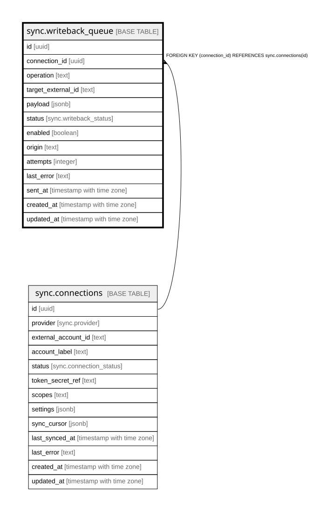

# sync.writeback_queue

## Description

Two-way sync. A dashboard edit (e.g. move an opportunity stage) lands here, then a writeback worker pushes it to Close / GHL. Curated allow-list via `enabled`; echo-loop guard via `origin`, so the write-back does not come straight back through the inbound sync.

## Columns

| Name | Type | Default | Nullable | Children | Parents | Comment |
| ---- | ---- | ------- | -------- | -------- | ------- | ------- |
| id | uuid | gen_random_uuid() | false |  |  |  |
| connection_id | uuid |  | false |  | [sync.connections](sync.connections.md) |  |
| operation | text |  | false |  |  |  |
| target_external_id | text |  | false |  |  |  |
| payload | jsonb |  | false |  |  |  |
| status | sync.writeback_status | 'pending'::sync.writeback_status | false |  |  |  |
| enabled | boolean | false | false |  |  |  |
| origin | text |  | true |  |  |  |
| attempts | integer | 0 | false |  |  |  |
| last_error | text |  | true |  |  |  |
| sent_at | timestamp with time zone |  | true |  |  |  |
| created_at | timestamp with time zone | now() | false |  |  |  |
| updated_at | timestamp with time zone | now() | false |  |  |  |

## Constraints

| Name | Type | Definition |
| ---- | ---- | ---------- |
| writeback_queue_connection_id_fkey | FOREIGN KEY | FOREIGN KEY (connection_id) REFERENCES sync.connections(id) |
| writeback_queue_pkey | PRIMARY KEY | PRIMARY KEY (id) |

## Indexes

| Name | Definition |
| ---- | ---------- |
| writeback_queue_pkey | CREATE UNIQUE INDEX writeback_queue_pkey ON sync.writeback_queue USING btree (id) |
| idx_writeback_status | CREATE INDEX idx_writeback_status ON sync.writeback_queue USING btree (status) |
| idx_writeback_connection_fk | CREATE INDEX idx_writeback_connection_fk ON sync.writeback_queue USING btree (connection_id) |

## Triggers

| Name | Definition |
| ---- | ---------- |
| trg_writeback_queue_updated | CREATE TRIGGER trg_writeback_queue_updated BEFORE UPDATE ON sync.writeback_queue FOR EACH ROW EXECUTE FUNCTION set_updated_at() |

## Relations

---

> Generated by [tbls](https://github.com/k1LoW/tbls)
